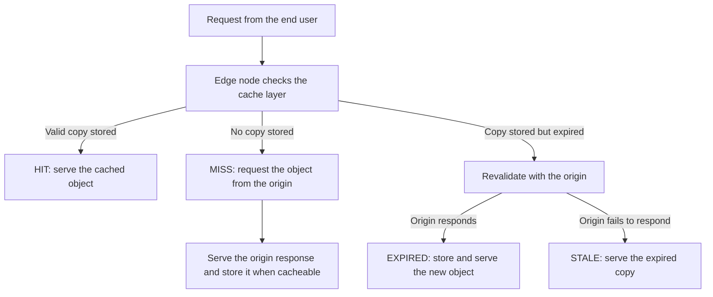

**Cache** stores content on Azion edge nodes, in a layer that sits between your origin servers and the end user. An edge node that holds a valid copy answers from that layer, and the request never reaches the origin. An edge node that holds no valid copy fetches the object from the origin.

Five mechanisms decide what an edge node does with a request: the cache lookup, the cache status it reports, origin protection, expiration, and stale cache.

## Cache lookup

An Azion edge node resolves every request against the cache layer before it contacts the origin. The edge node identifies a stored object by its cache key. The result of the lookup decides the path the request takes.



The diagram shows the outcomes of one lookup. A valid stored copy is a HIT, and the edge node answers without contacting the origin. No stored copy is a MISS, and the edge node requests the object from the origin, then stores the response when it is cacheable.

A stored copy that has expired sends the edge node to the origin to revalidate. When the origin responds, the edge node stores the new object and reports EXPIRED. When the origin fails and stale cache is turned on, the edge node serves the expired copy and reports STALE.

To read the rules that form the key an edge node looks up, refer to [Cache keys](/en/documentation/build/cache/reference/cache-keys/).

## Cache status

An Azion edge node reports the outcome of every cache lookup as a cache status. You can obtain the cache status of an application's resource by requesting the content URI and adding the Azion debug header `Pragma: azion-debug-cache`. A successful response returns an `X-Cache` header with the cache status, the IP of the edge node, and the protocol used in the request:

```bash
X-Cache: HIT from 200.000.000.00 with HTTP/2.0
```

### Status definitions

| Status | Definition |
| --- | --- |
| **HIT** | Valid and up-to-date content is supplied directly from the cache at the edge |
| **MISS** | If the requested content is not found in the cache at the edge, it is fetched from the origin. Through the response, the content might be cached for future requests |
| **EXPIRED** | The cached content has expired the TTL set at the edge. When the origin responds, the cached content is updated for future requests |
| **STALE** | When choosing to serve [stale cache](#stale-cache), if the origin fails to respond and the cache at the edge has expired, a stale version of the content is served |
| **UPDATING** | The cached content has expired and a stale cache is being served, but the content is being updated in the origin |
| **REVALIDATED** | The cached content is checked against the origin using conditional headers. If it is still up-to-date, the resource is not retransmitted from the origin |
| **BYPASS** | The edge requests the content from the origin directly instead of using a cached version due to the active [Bypass Cache](/en/documentation/build/applications/reference/rules-engine/#bypass-cache) behavior |
| **-** | If no status is received, the content requested is restricted from caching. For instance, if the requested content is a `POST` request and [Caching for POST](/en/documentation/build/cache/reference/cache-settings/#caching-http-methods) is disabled, the status is not logged |

---

## Origin protection

When the requested content is not available in the cache, Cache applies two mechanisms that limit the load a non-HIT request places on the origin server.

Azion edge nodes maintain keep-alive connections with the origin server whenever possible, to reduce the overhead associated with frequent TCP/IP handshakes. Keep-alive connections apply during cache updates and in situations of a cache MISS.

Azion also implements Thundering Herd control. For multiple simultaneous requests for the same non-cached object, only one connection is established with the origin server. Each Azion edge node requests content from the origin server only once per MISS or other non-HIT status.

## Expiration

Two time-to-live (TTL) values control cache expiration: the browser cache TTL and the cache TTL at the edge.

The browser cache TTL controls how long the content remains stored on local browsers. A longer browser TTL reduces how often users fetch content from the edge or the origin. Load times improve and bandwidth usage drops.

The cache TTL at the edge controls how long your content remains cached on Azion edge nodes. A longer cache TTL keeps frequently accessed content closer to users and reduces the load on the origin server.

The tradeoff is freshness against origin load. A long TTL cuts requests to the origin and serves content the origin may have already changed. A short TTL keeps content current and sends more requests to the origin. Set both values from the update frequency of your content, your traffic patterns, and your performance objectives.

---

## Stale cache

**Stale Cache** lets Azion edge nodes keep serving previously cached objects after those objects expire. The end user receives an expired copy instead of a downtime or error page, while the edge node fetches fresh content from your origin.

An edge node resolves a request under stale cache in three stages:

1. A cache setting has **Enable Stale Cache** turned on. Every response stored in the cache at the edge can then be reused when a revalidation attempt fails because of:

   - 5xx errors returned by the origin.
   - Connection time-outs or origin unreachability.
   - Invalid or missing cache-control headers.
   - The object being updated (revalidation in progress).

2. The edge node first looks for the `stale-while-revalidate=<ttl>` directive. Under **Honor Origin Cache**, if the origin supplies the directive, its value defines how long the object may be served stale. Under **Override Cache Settings**, or when the origin omits the directive, Azion assigns a default stale window of 300 seconds (5 minutes).

3. During the stale window, the edge node serves the expired copy immediately and fetches a fresh version in the background. When the new object is stored, subsequent requests receive the updated content.

The tradeoff is that the end user reads content the origin no longer serves, for as long as the stale window lasts.

---

## Related resources

- [Cache](/en/documentation/build/cache/) - the module and its limits.
- [Cache Settings](/en/documentation/build/cache/reference/cache-settings/) - the fields that set TTL, stale cache, and adaptive delivery.
- [Cache keys](/en/documentation/build/cache/reference/cache-keys/) - the rules that form the key an edge node looks up.
- [Tiered Cache](/en/documentation/build/cache/tiered-cache/) - an extra cache layer between the edge and your origin servers.
- [Verify cache indicators in the browser](/en/documentation/build/cache/guides/check-page-cache-time/) - read the `X-Cache` header in Google Chrome.
- [Cache quickstart](/en/documentation/build/cache/quickstart/) - put a cache policy to work.
