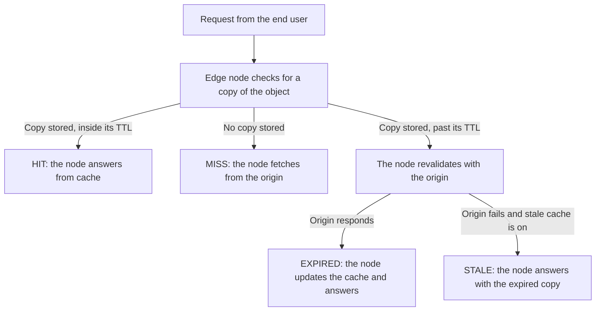

**Cache** stores content on Azion edge nodes, in a layer between your origin servers and the end user. When a node holds a valid copy, it answers from that layer and the request never reaches the origin. Otherwise, the node fetches the object from the origin.

Five mechanisms produce that outcome: the cache lookup, the cache status, origin protection, expiration, and stale cache.

## Cache lookup

Cache lookup runs on the edge node that receives the request, before the node opens any origin connection. A node with a valid copy answers immediately. Where the copy is missing or past its TTL, the node goes to the origin, and the origin's answer decides the rest.

One request follows one of four branches:



Two questions set the branch. The first is whether the node stores a copy of the object; the second is whether that copy is still inside its TTL. A stored copy inside its TTL produces a HIT, and no copy at all produces a MISS. The third case, a copy past its TTL, hands the decision to the origin. EXPIRED follows once the origin answers, and a failed origin with stale cache on produces STALE.

## Cache status

Azion edge nodes report a cache status for every lookup, and the `Pragma: azion-debug-cache` request header makes that status visible. The response then carries `X-Cache`, which names the status, the edge node IP, and the protocol:

```
X-Cache: HIT from 200.000.000.00 with HTTP/2.0
```

Eight values can appear in that header:

| Status | Meaning |
| --- | --- |
| `HIT` | Valid and up-to-date content supplied directly from the cache on the edge node. |
| `MISS` | Content not found in the cache on the edge node, so it is fetched from the origin. The response might be cached for future requests. |
| `EXPIRED` | Cached content has passed the TTL set on the edge node. When the origin responds, the cached content is updated for future requests. |
| `STALE` | When serving stale cache is chosen, and the origin fails to respond and the edge node cache has expired, a stale version is served. |
| `UPDATING` | Cached content expired and a stale cache is being served, but the content is being updated in the origin. |
| `REVALIDATED` | Cached content is checked against the origin using conditional headers. If it is still up to date, the resource is not retransmitted. |
| `BYPASS` | The edge node requests from the origin directly instead of using a cached version, because the [Bypass Cache](/en/documentation/build/applications/reference/rules-engine/#bypass-cache) behavior is active. |
| `-` | No status is received, and the content is restricted from caching. For instance, a `POST` request with [Caching for POST](/en/documentation/build/cache/reference/cache-settings/#caching-http-methods) disabled is not logged. |

---

## Origin protection

A MISS sends the request to the origin, so the origin takes load whenever the cache cannot answer. Azion limits that load in two ways.

Azion edge nodes hold keep-alive connections with the origin where possible, which cuts the overhead of frequent TCP/IP handshakes. Cache updates and MISS responses both use those connections.

Thundering Herd control covers the burst case. When many simultaneous requests ask for the same non-cached object, only one connection to the origin is opened. Each edge node requests the object from the origin once per MISS, or once per any other non-HIT status.

## Expiration

Two TTLs decide how long a cached copy stays usable. The browser cache TTL governs local browsers, where a longer value cuts fetches and the bandwidth they consume. On Azion edge nodes the edge cache TTL does the same job, and raising it cuts the load that reaches the origin.

Both settings trade freshness for load. A short TTL keeps the cached copy close to what the origin serves, at the cost of more origin requests. Raise either value and the reverse follows: fewer requests reach the origin, and the user can receive a copy that no longer matches the origin.

---

## Stale cache

Stale cache lets edge nodes answer with an object after it expires. The user receives an expired copy instead of an error page while a fresh version is fetched. **Enable Stale Cache** in a [cache setting](/en/documentation/build/cache/reference/cache-settings/) turns the behavior on.

An expired object is reused when revalidation fails for one of these reasons:

- The origin returns a 5xx error.
- The connection times out, or the origin is unreachable.
- The cache-control headers are invalid or missing.
- An update to the object is in progress, so revalidation is still running.

The length of the stale window comes from the `stale-while-revalidate=<ttl>` directive. Under **Honor Origin Cache**, the value the origin sends defines the window. Azion applies a default of 300 seconds (5 minutes) instead when the cache setting uses **Override Cache Settings**, or when the origin omits the directive.

During the window the edge node serves the expired copy at once, then fetches a fresh version in the background. That window has a cost: for as long as it lasts, the user reads content the origin no longer serves.

---

## Related resources

- [Cache](/en/documentation/build/cache/) - what the product caches and which settings control it.
- [Cache settings](/en/documentation/build/cache/reference/cache-settings/) - the fields that set the two TTLs and stale cache.
- [Cache keys](/en/documentation/build/cache/reference/cache-keys/) - what makes two requests match the same cached object.
- [Tiered Cache](/en/documentation/build/cache/tiered-cache/) - a second cache layer between the edge nodes and the origin.
- [Cache quickstart](/en/documentation/build/cache/quickstart/) - create a first cache setting.
- [Verify cache indicators](/en/documentation/build/cache/guides/check-page-cache-time/) - read the `X-Cache` header on a live request.
