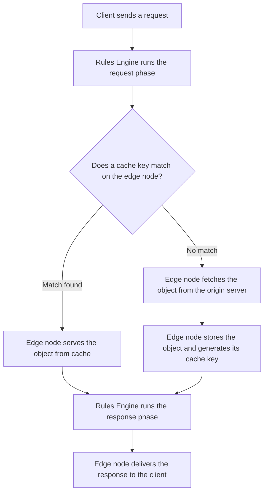
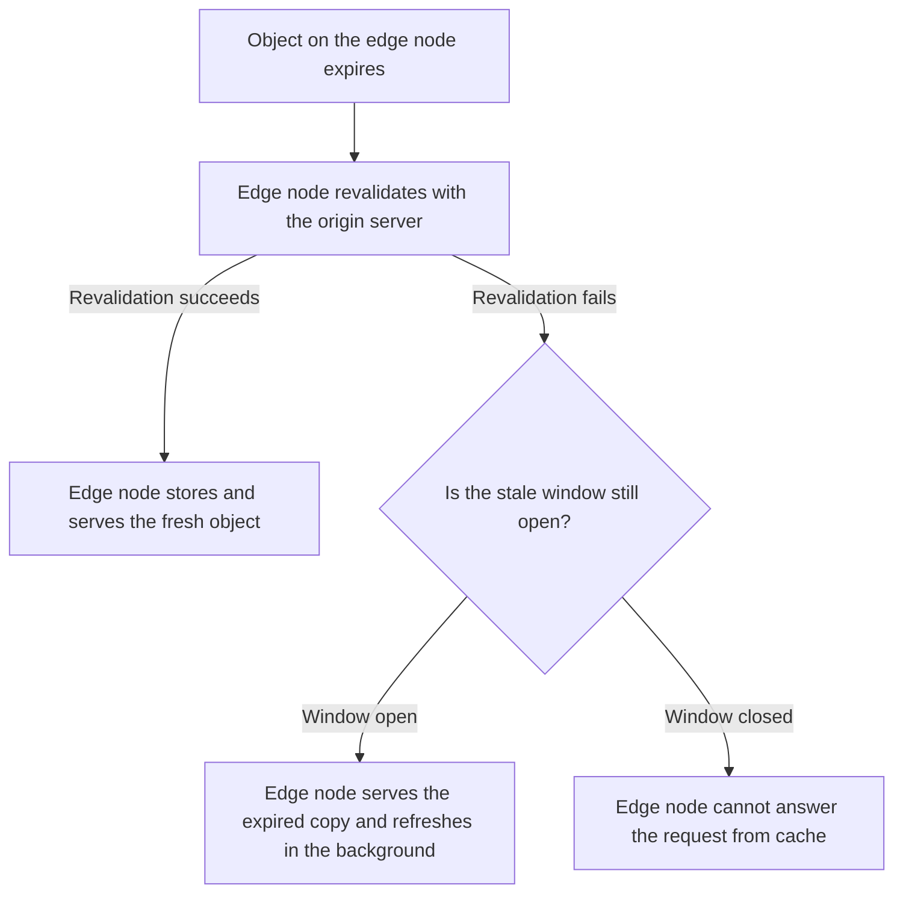

**Cache** stores a copy of a response on the Azion edge node that fetched it. The edge node answers later requests for the same object from that copy, without reaching the origin server. Cache is a module of [Applications](/en/documentation/build/applications/), and it sits between your origin servers and the people requesting your content.

An edge node identifies an object by its cache key, so two requests match the same cached object only when they build the same key. This page covers the lookup an edge node runs, the status it records, the mechanisms that hold requests off the origin, expiration, and stale cache.

---

## Cache lookup

An edge node runs the same sequence for every request an application receives:



[Rules Engine](/en/documentation/build/applications/reference/rules-engine/) processes the request phase first, where a rule can set the cache policy that applies to the request. The edge node then builds the cache key and looks for a matching object. A match is delivered straight from cache. Without a match, the edge node forwards the request to the origin server and stores the response. It also generates a cache key for the new object and returns it in the `X-Cache-Key` header. Rules Engine processes the response phase before the object reaches the client.

[Tiered Cache](/en/documentation/build/cache/tiered-cache/) adds a second cache layer between the edge nodes and your origin servers. A request that misses on the edge node can still find the object in that layer. The rules that build the cache key are described in [Cache keys](/en/documentation/build/cache/reference/cache-keys/).

---

## Cache status

Every request records one cache status, which states how the edge node answered it. The status separates a caching problem from an origin problem, because it names which copy served the response.

To read the status, request the content URI with the Azion debug header `Pragma: azion-debug-cache`. A successful response returns an `X-Cache` header with the status, the IP of the edge node, and the protocol used in the request:

```bash
X-Cache: HIT from 192.0.2.10 with HTTP/2.0
```

| Status | Meaning |
| --- | --- |
| `HIT` | Valid and up-to-date content comes from the cache on the edge node. |
| `MISS` | The edge node does not find the content in cache and fetches it from the origin. The response can be cached for later requests. |
| `EXPIRED` | The cached content passed the TTL set on the edge node. When the origin responds, the cached object is updated for later requests. |
| `STALE` | The cached content expired and the origin fails to respond, so the edge node serves a stale version. Requires [stale cache](#stale-cache). |
| `UPDATING` | The cached content expired and a stale version is served, while the content is being updated at the origin. |
| `REVALIDATED` | The edge node checks the cached content against the origin using conditional headers. Content that is still up to date is not retransmitted. |
| `BYPASS` | The edge node requests the content from the origin instead of using a cached version, because the [Bypass Cache](/en/documentation/build/applications/reference/rules-engine/#bypass-cache) behavior is active. |
| `-` | No status is logged, because the requested content is restricted from caching. A `POST` request with [caching for POST](/en/documentation/build/cache/reference/cache-settings/#caching-http-methods) turned off returns no status. |

For the steps to read these headers in a browser, refer to [Verify cache indicators in the browser](/en/documentation/build/cache/guides/check-page-cache-time/).

---

## Origin protection

A request that misses reaches the origin server, so the cost of a miss is the cost of an origin request. Cache reduces both the number of those requests and the work each one costs.

The edge node maintains keep-alive connections with the origin server whenever possible. Reusing an open connection removes the TCP/IP handshake from each fetch, which matters most during cache updates and on a `MISS`.

Thundering Herd control handles simultaneous demand for the same uncached object. When many requests arrive at once for one object that is not in cache, the edge node establishes a single connection with the origin server. Each Azion edge node requests the object from the origin only once per `MISS` or other non-`HIT` status. A burst of traffic does not become a burst of origin requests. The first request pays the full origin round trip, and the requests behind it wait for that one fetch to finish.

---

## Expiration

An object stays cached until its time-to-live (TTL) runs out. Cache carries two independent TTLs: one for the copy a browser keeps, and one for the copy an edge node keeps. While its TTL lasts, the browser copy answers without any request leaving the device, which lowers load times and bandwidth use. The copy on the edge node answers without the origin server.

Each TTL takes one of two behaviors. _Honor Origin Cache Headers_, the default, uses the TTL your origin sends. That TTL comes from the `max-age` directive of the `Cache-Control` header; when the response carries no `Cache-Control`, the timestamp in the `Expires` header decides it. _Override Cache Settings_ ignores both headers and applies the maximum TTL you set.

The TTL on Azion edge nodes accepts values from 60 to 31,536,000 seconds, or 1 year, and defaults to 60 seconds. [Application Accelerator](/en/documentation/build/application-accelerator/) lowers the minimum to 0 seconds. Tiered Cache keeps an object in its layer only when the TTL is at least 3 seconds.

A long TTL is the cheaper setting: fewer requests reach the origin, and the object stays close to users. It also means a change at the origin is invisible until the TTL runs out or you [purge](/en/documentation/build/cache/reference/real-time-purge/) the object. A short TTL inverts both: content stays current, and the origin answers more requests. How often the content changes decides which end of that tradeoff you want.

A TTL of 0 seconds is not a cache bypass. Parallel requests to an edge node still reach the origin as a single request. The edge node also validates the content with the `If-Modified-Since` parameter. The origin does not retransmit an unchanged object, which can produce a faster `304 Not Modified` response. A zero TTL still generates a cache object that lives 999 milliseconds. The fields that set both TTLs are described in [Cache Settings](/en/documentation/build/cache/reference/cache-settings/#browser-cache-settings).

---

## Stale cache

Stale cache lets an edge node keep serving an object after the object expires, so a failing origin produces old content instead of an error page. It is turned on by default in a cache setting.

An expired object becomes eligible for reuse when a revalidation attempt fails. Revalidation fails because of:

- 5xx errors returned by the origin.
- Connection timeouts or origin unreachability.
- Invalid or missing `Cache-Control` headers.
- A revalidation already in progress for the object.

The stale window then decides whether the expired copy can still answer:



The length of the stale window comes from the `stale-while-revalidate` directive. Under _Honor Origin Cache Headers_, an origin that supplies `stale-while-revalidate=<ttl>` defines how long the object may be served stale. Under _Override Cache Settings_, or when the origin omits the directive, Azion assigns a default stale window of 300 seconds, or 5 minutes.

Inside that window the edge node serves the expired copy immediately and fetches a fresh version in the background. Those responses record `STALE`, or `UPDATING` while the origin updates the object. When the new object is stored, later requests receive the updated content.

The tradeoff is exact: for as long as the stale window lasts, users receive content that the edge node already knows is out of date. Set the window against how wrong that content can be, not against how long your origin takes to recover.

---

## Related resources

- [Cache Settings](/en/documentation/build/cache/reference/cache-settings/) - The fields that set expiration, stale cache, and cache key variation.
- [Cache keys](/en/documentation/build/cache/reference/cache-keys/) - How an edge node builds the identifier it matches a request against.
- [Tiered Cache](/en/documentation/build/cache/tiered-cache/) - The second cache layer between the edge nodes and your origin servers.
- [Real-Time Purge](/en/documentation/build/cache/reference/real-time-purge/) - How to expire an object before its TTL runs out.
- [Cache limits](/en/documentation/build/cache/limits/) - Object size, fragment size, and TTL limits, by support plan.
- [Configure a cache policy](/en/documentation/build/cache/guides/cache-settings/) - Steps to create a cache setting and apply it with a rule.
- [Cache quickstart](/en/documentation/build/cache/quickstart/) - The first cache policy on an application, end to end.
