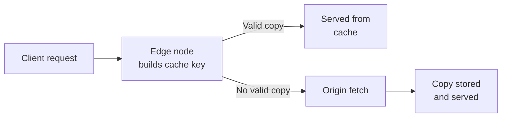
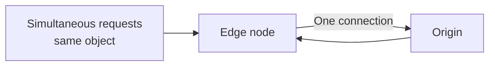
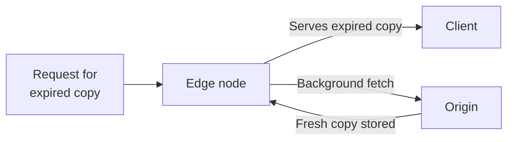
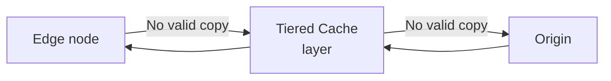
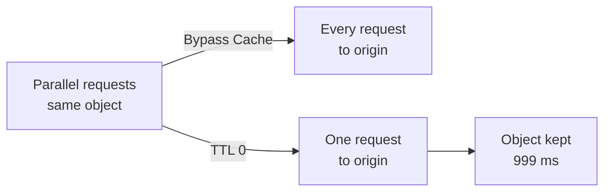

A cache keeps a copy of a response close to the people who ask for it. When a browser requests an object, the edge node nearest to it checks whether it already holds a valid copy. If it does, the edge node answers from that copy and the request never reaches your origin. If it does not, the edge node fetches the object from the origin, serves it, and keeps a copy for the next request. The rest of the behavior is a set of rules. They decide how long that copy stays valid, what happens when the origin cannot answer, and how many requests reach the origin while no copy exists.

On Azion, [Cache](/en/documentation/build/cache/) is an [Applications](/en/documentation/build/applications/) module that applies those rules on every edge node of Azion's distributed network. A cache setting holds the rules for a group of requests. It sets how long a copy stays valid, whether an expired copy may be served, and which parts of a request change the cache key. A [Set Cache Policy](/en/documentation/build/applications/reference/rules-engine/#set-cache-policy) rule in Rules Engine chooses the cache setting that a request follows. [Tiered Cache](/en/documentation/build/cache/tiered-cache/), a Cache module, adds a second cache layer between the edge nodes and your origin. [Real-Time Purge](/en/documentation/build/cache/reference/real-time-purge/) removes a copy before it expires.

Seven mechanisms shape that behavior: the lookup path, cache status, origin protection, expiration and revalidation, stale delivery, the tiered layer, and Bypass Cache versus TTL 0.

## Lookup path

An edge node decides whether it already holds the object a request asks for by building a cache key. A cache key is the identifier an edge node builds from a request to decide whether two requests match the same cached object. Cache builds it from the request URI and appends a variation marker when the object varies by cookie, query string, device group, or image format. Two requests with the same cache key share one cached object, and a different key names a different object. For the key format and every variation marker, refer to [Cache keys](/en/documentation/build/cache/reference/cache-keys/).

The diagram shows the two outcomes of a lookup. When the edge node holds a valid copy under that key, it serves the copy and the request ends there. Otherwise the edge node forwards the request to the origin, serves the response, and stores a copy under the key for the next request. With Tiered Cache enabled, a second cache layer sits between the edge node and the origin on that path.

By default an edge node caches responses to `GET` and `HEAD` requests only. A cache setting can extend caching to `POST` and `OPTIONS` requests, which adds the request body to the cache key. For those options, refer to [Cache Settings](/en/documentation/build/cache/reference/cache-settings/).

A copy lives on the edge node that fetched it. The first request for an object at each edge node is therefore a MISS, and the origin answers that first request once per edge node. Cache keys are also case sensitive, so two URIs that differ only in letter case are two cached objects.

---

## Cache status

Every response an edge node serves carries a cache status that records how the lookup ended. The status says whether a copy existed, whether it was still valid, and whether the origin took part. Cache uses eight values:

| Status | Meaning |
| --- | --- |
| `HIT` | A valid, up-to-date copy was served from the edge node. |
| `MISS` | No copy was found, so the edge node fetched the object from the origin. The response may be stored for later requests. |
| `EXPIRED` | The copy had passed its TTL. When the origin responds, the stored copy is updated. |
| `STALE` | The copy had expired and the origin failed to respond, so the edge node served the expired copy. Requires Stale Cache. |
| `UPDATING` | The copy had expired, an expired copy was served, and the object is being updated from the origin. |
| `REVALIDATED` | The copy was checked against the origin with conditional headers and was still up to date, so the origin did not resend it. |
| `BYPASS` | The edge node sent the request to the origin without using a copy, because a Bypass Cache rule applies. |
| `-` | No status. The object is restricted from caching, for example a `POST` request when caching for `POST` is turned off. |

To read the status of one response, send the request with the `Pragma: azion-debug-cache` header. The `X-Cache` response header then carries the status, the IP of the edge node, and the protocol of the request. For the full set of debug headers, refer to [Cache keys](/en/documentation/build/cache/reference/cache-keys/). To read them from a browser, refer to [Verify cache indicators in the browser](/en/documentation/build/cache/guides/check-page-cache-time/).

The same values reach your logs as the `Upstream Cache Status` field in [Real-Time Events](/en/documentation/observe/real-time-events/) and the `$upstream_cache_status` variable in [Data Stream](/en/documentation/observe/data-stream/).

A status describes the edge node that answered, not the whole network. The same URL can return `HIT` from one edge node and `MISS` from another, because each edge node keeps its own copies.

## Origin protection

A missing or expired copy sends a request to the origin, and a popular object can be missing on many edge nodes at the same moment. Two mechanisms limit what the origin receives on that path.

The first is the connection itself. Whenever possible, an edge node keeps its connection to the origin open and reuses it for later fetches. Each reused connection skips a TCP/IP handshake, and the saving is largest during cache updates and on a MISS, when the origin is contacted most.

The second is Thundering Herd control. When several requests for the same non-cached object arrive at an edge node at the same time, the edge node opens only one connection to the origin. Each edge node therefore asks the origin once per MISS, or once per other non-HIT status, however many requests arrived together.

The diagram shows several requests for one object arriving at an edge node and leaving it as a single origin connection.

Both mechanisms work per edge node. An object requested across Azion's distributed network is still fetched once by every edge node that receives a request for it. The origin sees one request per edge node rather than one in total. Tiered Cache narrows that further by placing a cache layer between the edge nodes and the origin.

---

## Expiration and revalidation

A copy that never expired would serve the origin's old content forever. Each copy therefore carries a TTL, the number of seconds during which the edge node considers it valid. A cache setting sets two of them. The browser cache TTL controls how long a browser keeps its own copy, so a longer value means fewer requests reach the edge nodes at all. The TTL on the edge nodes controls how long the edge node keeps its copy, so a longer value means fewer requests reach the origin.

For each TTL, the cache setting either honors the headers the origin sends or overrides them with a value you set. When it honors the origin, the `max-age` directive of `Cache-Control` sets the TTL. When `Cache-Control` is absent, the timestamp in the `Expires` header sets it. When the setting overrides the origin, the value you set applies whatever headers the origin sends. For the fields that select each mode, refer to [Cache Settings](/en/documentation/build/cache/reference/cache-settings/).

When the TTL ends, the copy is expired but not deleted. The next request for it goes to the origin with the status `EXPIRED`, and the response replaces the stored copy. An expired copy can also be revalidated. The edge node checks it against the origin with conditional headers, and when the object is unchanged the origin does not resend it. The status is then `REVALIDATED`, and the stored copy stays in use.

The TTL trades freshness for origin load. A long TTL keeps frequently requested objects on the edge nodes and cuts traffic to the origin. A short TTL keeps users closer to the current content, at the cost of more origin fetches. The TTL on the edge nodes runs from 60 to 31,536,000 seconds, with a 0-second floor under [Application Accelerator](/en/documentation/build/application-accelerator/) and a 3-second floor under Tiered Cache. For every limit by plan, refer to [Cache limits](/en/documentation/build/cache/limits/).

Expiry is not the only way a copy leaves the cache. When you update an object at the origin, the edge nodes keep serving the stored copy until its TTL ends. Real-Time Purge removes the copy from the edge nodes or from the tiered layer, so the next request fetches the latest version from the origin. For the purge types and their arguments, refer to [Real-Time Purge](/en/documentation/build/cache/reference/real-time-purge/).

## Stale delivery

An expired copy normally means a trip to the origin. When the origin returns an error or does not answer, that trip fails, and without a fallback the user receives an error page. Stale Cache lets the edge node serve the expired copy instead while it fetches a fresh one.

Stale Cache is enabled by default in a cache setting. When it is on, an expired copy may be reused if a revalidation attempt fails. The causes are:

- A 5xx error returned by the origin.
- A connection time-out or an unreachable origin.
- An invalid or missing cache-control header.
- An update already in progress for the object.

The length of the stale window comes from the `stale-while-revalidate=<ttl>` directive, which the edge node looks for first. When the cache setting honors origin headers and the origin sends the directive, that value sets how long the object may be served stale. When the setting overrides origin headers, or the origin omits the directive, the window is 300 seconds.

The diagram shows the two things the edge node does at once during the stale window. It answers the client from the expired copy immediately, and it fetches a fresh version from the origin in the background. The status is `STALE` when the origin failed to respond and `UPDATING` while the update is in progress. Once the new object is stored, later requests receive it.

The price is age. During the stale window a user can receive content that is older than its TTL, for as long as the window lasts. When an error is preferable to an old copy, remove the object with the `DEL` method instead of Real-Time Purge. The next `GET` request then goes to the origin, and when the origin is unreachable the edge node delivers an error page instead of a stale object. For the switch that turns Stale Cache off, refer to [Cache Settings](/en/documentation/build/cache/reference/cache-settings/).

---

## Tiered layer

Origin protection works per edge node, so an object that many edge nodes request is fetched from the origin once by each of them. Tiered Cache adds a second cache layer between the edge nodes and your origin to absorb those fetches.

When an edge node holds no valid copy, it asks the tiered layer before it asks the origin. Only when the tiered layer holds no valid copy either does the request reach the origin, and the response then fills both layers on its way back. The tiered layer keeps content cached for longer than the edge nodes, and its servers sit in a region chosen for your account.

The diagram shows the miss path with Tiered Cache enabled. A miss on the edge node reaches the tiered layer first, and a miss on the tiered layer reaches the origin. Fewer requests reach the origin, which lowers the load your servers handle.

The layer has its own conditions. Tiered Cache must be activated for your account through the Sales team, and a cache setting that uses it has its own TTL floor and ceiling. Purge order also matters: purge the tiered layer first and the edge nodes afterwards, otherwise the edge nodes refill from outdated tiered content. A wildcard purge does not reach the tiered layer, and neither does a Bypass Cache rule. For activation, regions, the TTL range, and purge ordering, refer to [Tiered Cache](/en/documentation/build/cache/tiered-cache/).

## Bypass Cache versus TTL 0

Some content must come from the origin on every request. Two settings look alike: a Bypass Cache rule, and a cache setting whose TTL is 0 seconds. Their effects differ.

A [Bypass Cache](/en/documentation/build/applications/reference/rules-engine/#bypass-cache) rule tells the edge node not to cache the origin's response for the requests it matches. Every HTTP and HTTPS request the edge nodes receive for that path is sent to the origin, and nothing is stored; the status is `BYPASS`. The edge node still keeps its protocol optimizations and its keep-alive connection to the origin whenever possible. The rule has no effect on the browser cache, which the Set Cache Policy behavior governs. Bypass Cache is a Rules Engine behavior and requires Application Accelerator.

A TTL of 0 seconds keeps the copy in the lookup path. The edge node still creates a cache object, and that object lives for 999 milliseconds. Parallel requests to an edge node collapse into a single request to the origin, as in Thundering Herd control. The edge node also validates the copy with the origin using `If-Modified-Since`. When the object has not changed, the origin answers `304 Not Modified` and does not resend the content, which is much faster than a full transfer. A TTL under the default floor requires Application Accelerator; for the values, refer to [Cache limits](/en/documentation/build/cache/limits/).

The diagram shows what a burst of parallel requests becomes under each setting. Under Bypass Cache every request becomes an origin request. Under TTL 0 the burst becomes one origin request, and the object it creates lives for 999 milliseconds.

Use Bypass Cache when each request must receive different content, and accept that the origin then handles every request. Use TTL 0 when dynamic content that changes over time can be delivered identically to everyone who requests it at the same moment. A request that arrives within those 999 milliseconds can receive the stored copy, which is the point of the setting and its limit.

:::note
A Bypass Cache rule applies to the cache on the edge nodes only. An application with Tiered Cache active keeps caching in the tiered layer for the minimum TTL, even for requests the rule matches.
:::

---

## Related resources

- [Cache Settings](/en/documentation/build/cache/reference/cache-settings/) - every field of a cache setting, including the TTL modes, Stale Cache, and the cache key options.
- [Cache keys](/en/documentation/build/cache/reference/cache-keys/) - the key format, every variation marker, and the debug headers.
- [Real-Time Purge](/en/documentation/build/cache/reference/real-time-purge/) - purge types, layers, and argument formats.
- [Tiered Cache](/en/documentation/build/cache/tiered-cache/) - activation, regions, TTL range, and purge ordering for the tiered layer.
- [Cache limits](/en/documentation/build/cache/limits/) - every limit value, by plan.
- [Cache quickstart](/en/documentation/build/cache/quickstart/) - create a cache setting and apply it with a rule.
- [Configure a cache policy](/en/documentation/build/cache/guides/cache-settings/) - the Console procedure for a cache setting and its rule.
- [Verify cache indicators in the browser](/en/documentation/build/cache/guides/check-page-cache-time/) - read the cache status and cache key of a response.
- [Rules Engine](/en/documentation/build/applications/reference/rules-engine/) - the Set Cache Policy and Bypass Cache behaviors.
