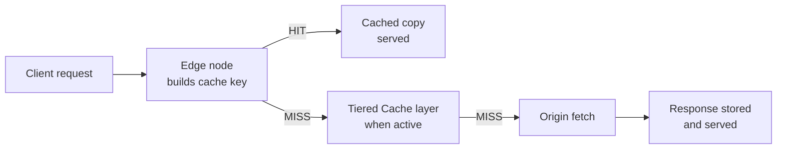

import LinkButton from 'azion-webkit/linkbutton'
import Code from '~/components/Code/Code.astro'

A cache is a stored copy of a response, kept close to the people who request it. The first request for an object travels to the origin server, and the copy that comes back is stored. Later requests for the same object are answered from the copy. Each copy has a time to live (TTL), the number of seconds it stays valid. Within that window the origin serves an object once, not once per request. For the general mechanism, refer to [What is caching](https://www.azion.com/en/learning/cdn/what-is-caching/) in the Learning Center.

**Cache** stores those copies on Azion edge nodes, as a module of [Applications](/en/documentation/build/applications/). A cache setting holds the policy: how long a browser and an edge node keep an object, and what tells two objects apart. A rule in [Rules Engine](/en/documentation/build/applications/reference/rules-engine/) applies the setting to the requests it matches. The edge node nearest the client then answers from its copy while the copy is valid. Your [origin](/en/documentation/secure/connectors/reference/origins/) receives one fetch per object on each edge node instead of one per request. Use Cache to serve static files from edge nodes, keep pages up while your origin is down, cache API responses by cookie or query string, or deliver large files in fragments.

<LinkButton label="Cache quickstart" link="/en/documentation/build/cache/quickstart/" />
<LinkButton severity="secondary" label="Cache Settings reference" link="/en/documentation/build/cache/reference/cache-settings/" />

## Cache setting structure

A cache setting is the object that holds one cache policy. An application holds one or more of them, and a rule picks which one a request uses. The request body below creates a cache setting through the API. It overrides the origin's cache headers with a 60-second browser TTL and a 13,660-second edge TTL. Stale Cache stays on:

<Code lang="json" code={`{
  "name": "<your-cache-setting-name>",
  "browser_cache": {
    "behavior": "override",
    "max_age": 60
  },
  "modules": {
    "edge_cache": {
      "behavior": "override",
      "max_age": 13660,
      "stale_cache": {
        "enabled": true
      }
    }
  }
}`} />

- `browser_cache` sets what the browser does with the object. `honor` passes the origin's `Cache-Control` and `Expires` headers through, and `override` replaces them with `max_age`, in seconds.
- `modules.edge_cache` makes the same choice for the copy on the edge node, with the same two behaviors and its own `max_age`.
- `stale_cache` decides whether an expired copy is served while the origin fails or while the copy is refreshed.

If you know the `max-age` directive of `Cache-Control`, you know what `max_age` does. Each field states that value in seconds, once for the browser and once for the edge node. Every key, including the query string, cookie, device group, and HTTP method variations, is in [Cache Settings](/en/documentation/build/cache/reference/cache-settings/).

---

## Lookup path

A new cache setting does not apply to any request by itself. A rule with the Set Cache Policy behavior attaches it to the requests the rule matches. Every request an edge node receives then follows this path:

The diagram shows one request from the client to the stored response. Without Tiered Cache, the MISS path goes straight from the edge node to your origin.

1. Azion routes the request to the edge node nearest the client.
2. The edge node builds a cache key from the scheme, host, path, and query string of the request. A cache setting that varies content by cookie, [device group](/en/documentation/build/applications/reference/device-groups/), or HTTP method appends a marker to that key, and keys are case sensitive.
3. When the cache holds a valid object under that key, the node serves it and logs the status `HIT`. Your origin receives nothing.
4. Otherwise the node fetches the object from your origin and logs `MISS`. When Tiered Cache is active, the fetch passes through the tiered layer between the edge nodes and the origin, which keeps its own copy for longer.
5. When many requests arrive at once for one uncached object, the node opens one connection to the origin. The origin serves that object once per MISS on each edge node.
6. The response is stored under the key and served. It stays valid for its TTL. A later request then finds it `EXPIRED` and refreshes it, or, with Stale Cache on, receives the expired copy while the refresh runs.

The eight cache status values, keep-alive connections, revalidation, and the stale window are in [How Cache works](/en/documentation/build/cache/how-it-works/).

---

## Capabilities and limits

The block below states what a cache setting can do and where the platform stops it. Every value matches [Cache limits](/en/documentation/build/cache/limits/), which carries the full tables by plan.

- **TTL.** The TTL on the edge node runs from 60 to 31,536,000 seconds, set in `max_age` or taken from the origin's headers. A value under 60 seconds, down to 0, requires the [Application Accelerator](/en/documentation/build/application-accelerator/) module. A cache setting with Tiered Cache needs a TTL of at least 3 seconds, and the tiered layer holds an object for up to 2,592,000 seconds.
- **Cache key variations.** By default each URL is one object in cache, and only `GET` and `HEAD` responses are cached. A cache setting can also vary the key by query string fields, cookie names, device group, and the body of a cached `POST` or `OPTIONS` request. Query string, cookie, and method variations require Application Accelerator, and [Image Processor](/en/documentation/build/image-processor/) adds an image format variation. The format of every marker is in [Cache keys](/en/documentation/build/cache/reference/cache-keys/).
- **Stale Cache.** On by default. When the origin returns a `5xx` error, times out, or is still refreshing the object, the edge node serves the expired copy. The stale window is 300 seconds by default. A setting that honors origin headers takes the origin's `stale-while-revalidate` value instead.
- **Large File Optimization.** Splits a large object into fragments of 1,024 kB by default. Each fragment is cached on demand, under its own cache key, as the client consumes it. A single object in cache can be up to 10 GB. To raise either value for your plan, contact the [technical support team](/en/documentation/services/support/).
- **Tiered Cache.** A Cache module that adds a second cache layer between the edge nodes and your origin, activated for your account through the [Sales team](https://www.azion.com/en/contact-sales/). Its servers run in the United States by default, or in Brazil on request. A Bypass Cache rule does not reach this layer: an application with Tiered Cache keeps caching there for the minimum TTL. Activation, regions, and purge order are in [Tiered Cache](/en/documentation/build/cache/tiered-cache/).
- **Purge.** [Real-Time Purge](/en/documentation/build/cache/reference/real-time-purge/) removes an object from the cache on edge nodes or from the Tiered Cache layer before its TTL ends, by URL, cache key, or wildcard. A wildcard purge does not reach the Tiered Cache layer.
- **Observability.** Each request logs its cache status as `Upstream Cache Status` in [Real-Time Events](/en/documentation/observe/real-time-events/), in the HTTP Requests and Tiered Cache data sources, and as `$upstream_cache_status` in [Data Stream](/en/documentation/observe/data-stream/). Real-Time Events also exposes its fields through the [GraphQL API](/en/documentation/devtools/graphql-api/features/gql-real-time-events-fields/). For a single response, send the `Pragma: azion-debug-cache` request header and read the `X-Cache` and `X-Cache-Key` response headers.
- **Runtime Cache API.** A function reads and writes Cache through the [Cache API](/en/documentation/runtime/api-reference/cache/). It opens a named cache store with `caches.open`, then calls `match`, `put`, and `delete` on it.
- **WebSocket Proxy.** Incompatible with Cache and Tiered Cache. An application that uses [WebSocket Proxy](/en/documentation/build/applications/reference/websocket/) cannot use either module, because the connection is bidirectional and stays open.
- **Pricing.** Cache is billed by purges, per 1,000 operations, and the purge allowance for each plan is on the Cache limits page. Application Accelerator is billed separately, by data transfer. For more information, refer to [Pricing](/en/documentation/platform/pricing/#cache).

---

## Next steps

| If you want to | Go to |
| --- | --- |
| Create a cache setting and apply it to your first application | [Cache quickstart](/en/documentation/build/cache/quickstart/) |
| Understand the lookup, the eight cache statuses, expiration, and stale delivery | [How Cache works](/en/documentation/build/cache/how-it-works/) |
| Look up every field, option, and API key of a cache setting | [Cache Settings](/en/documentation/build/cache/reference/cache-settings/) |
| See how a cache key is built and which variations change it | [Cache keys](/en/documentation/build/cache/reference/cache-keys/) |
| Remove an object from cache before its TTL ends | [Real-Time Purge](/en/documentation/build/cache/reference/real-time-purge/) |
| Add a second cache layer between edge nodes and your origin | [Tiered Cache](/en/documentation/build/cache/tiered-cache/) |
| Check a limit by plan | [Cache limits](/en/documentation/build/cache/limits/) |
| Configure a policy in Console or through the API, purge content, verify cache headers, or cache HLS | [Cache guides and tutorials](/en/documentation/build/cache/guides/) |
| Manage cache settings from code | [`azion create`](/en/documentation/devtools/cli/create/), [`azion.config.js`](/en/documentation/devtools/cli/configs/azion-config-js/), [Terraform Applications resources](/en/documentation/products/terraform-provider/resources/applications/), or [Azion Libraries, Application](/en/documentation/products/azion-lib/application/) |
| Purge from code | [`azion purge`](/en/documentation/devtools/cli/purge/) or [Azion Libraries, Purge](/en/documentation/products/azion-lib/purge/) |
| Look up a term | [Glossary](/en/documentation/build/cache/glossary/) |
