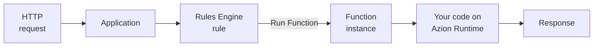

import LinkButton from 'azion-webkit/linkbutton'
import Code from '~/components/Code/Code.astro'

A function is code that runs when a request arrives, on infrastructure Azion operates. You write a handler that receives the request and returns a response. The platform starts the handler on demand and stops it when the response is sent, so there is no server to provision or scale. That model is called [serverless](https://www.azion.com/en/learning/serverless/what-is-serverless/).

**Functions** runs that code in JavaScript on Azion's distributed network, inside the request path of an application or a firewall. Use Functions to build APIs, manipulate request and response headers, apply logic from request metadata, or block traffic before it reaches your application.

<LinkButton label="Quickstart" link="/en/documentation/build/functions/quickstart/" />
<LinkButton severity="secondary" label="How Functions works" link="/en/documentation/build/functions/how-it-works/" />

## Function structure

A function exports one default object whose keys are handlers. The `fetch` handler answers an HTTP request:

<Code lang="javascript" code={`
export default {
  fetch: async (request, env, ctx) => {
    const url = new URL(request.url);

    if (url.pathname === '/api/hello') {
      return new Response(JSON.stringify({ message: 'Hello World' }), {
        headers: { 'Content-Type': 'application/json' }
      });
    }

    return new Response('Not Found', { status: 404 });
  }
};
`} />

- **`export default`** exposes the object Azion Runtime reads. Each key names a handler for one event.
- **`fetch(request, env, ctx)`** runs on an HTTP request. `env` holds environment variables and bindings, and `ctx.waitUntil(promise)` extends the function's lifetime for async tasks.
- **The returned `Response`** answers the request.
- **`addEventListener('fetch', ...)`** is the legacy Service Worker form. It still runs, for backward compatibility, and Azion recommends ES Modules for new code.

If you know the Web `Request` and `Response` objects, you know the code model. Every signature and parameter is in [Handlers](/en/documentation/build/functions/reference/handlers/).

---

## Invocation path

Creating a function does not expose it automatically. A function runs only when a rule inside an [application](/en/documentation/build/applications/) asks for it:

1. A function holds your code. By itself it answers no request.
2. A function instance binds the function to one application and carries its JSON args, so one function serves several applications with different values.
3. A rule in [Rules Engine](/en/documentation/build/applications/reference/rules-engine/) matches requests by criteria, such as a URI that starts with `/`.
4. The **Run Function** behavior on that rule names the instance to execute.
5. [Azion Runtime](/en/documentation/runtime/overview/) processes the function, and the `fetch` handler returns the response.

## Languages, APIs, and limits

- **Language**: JavaScript, with strict mode as the default and required option. Functions also runs WebAssembly (Wasm).
- **APIs**: Azion Runtime supplies Web APIs for network, encoding and decoding, Web Streams, standards, and V8 primitives, plus a [Node.js compatibility](/en/documentation/products/azion-edge-runtime/compatibility/node/) layer. The full set is in [Supported Web APIs](/en/documentation/runtime-apis/javascript/).
- **Frameworks**: [Azion Bundler](https://github.com/aziontech/bundler) converts a project's server-side logic, API routes, and middleware into functions that run on Azion Runtime. Refer to [Frameworks compatibility](/en/documentation/products/devtools/azion-edge-runtime/frameworks-compatibility/).
- **Data and AI**: a function reads [environment variables](/en/documentation/products/functions/environment-variables/), accesses databases such as [SQL Database](/en/documentation/store/sql-database/), and calls [AI Inference](/en/documentation/build/ai-inference/) models that run on Azion Runtime.
- **Tooling**: Azion Console carries a [code editor](/en/documentation/products/applications/functions/runtime-api/code-editor/) with syntax highlighting, IntelliSense, and debugging. [Preview Deployment](/en/documentation/products/applications/functions/runtime-api/preview-deployment/) runs a simulated request before the code goes to production, and an [AI assistant](/en/documentation/products/applications/functions/runtime-api/ai-integration/) explains, generates, and refactors code.
- **Limits**: a function gets 512 MB of memory per isolate and 2 seconds of CPU time per invocation. It makes at most 50 outbound `fetch()` calls, runs for at most 5 minutes of wall-clock time, and takes at most 2 seconds to initialize. Code is capped at 6 MB through Azion Console and 20 MB through the API. To raise a limit on your plan, contact [technical support](/en/documentation/services/support/). Every value is in [Functions limits](/en/documentation/build/functions/limits/).

---

## Functions on Firewall

[Firewall](/en/documentation/secure/firewall/) also runs functions, in the request phase, before a request reaches your application. A rule in Firewall Rules Engine triggers the function, Azion Runtime processes it, and Firewall Rules Engine resumes from the behavior that ran it.

The handler is `firewall(request, env, ctx)`. It blocks a request with `ctx.deny()`, and when it does not call `ctx.deny()`, the request continues to the `fetch` handler. A firewall function reads request metadata, such as GeoIP, the remote address, the server protocol, and TLS. It also matches an IP address against a network list.

For more information, refer to [Functions for Firewall](/en/documentation/secure/firewall/reference/functions/).

## Next steps

| If you want to | Go to |
| --- | --- |
| Run your first function now | [Quickstart](/en/documentation/build/functions/quickstart/) |
| Understand what invokes a function | [How Functions works](/en/documentation/build/functions/how-it-works/) |
| Look up a handler, a parameter, or a limit | [Handlers](/en/documentation/build/functions/reference/handlers/) |
| Bind a function to an application | [Functions Instances](/en/documentation/build/functions/reference/functions-instances/) |
| Follow a worked example | [Guides and tutorials](/en/documentation/build/functions/guides/) |
| Read the logs a function produces | [Debugging](/en/documentation/devtools/debugging/) |
| Look up a term | [Glossary](/en/documentation/build/functions/glossary/) |
