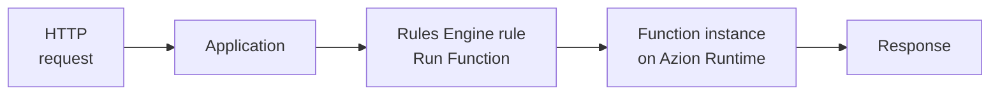

import LinkButton from 'azion-webkit/linkbutton'
import Code from '~/components/Code/Code.astro'

A function is code that runs in response to an event, such as an HTTP request, on infrastructure a provider operates. You write a handler that receives the request and returns a response. The provider starts the handler on demand and stops it once the response is sent. That model is called [serverless](https://www.azion.com/en/learning/serverless/what-is-serverless/): there is no server for you to provision, patch, or scale.

**Functions** runs that handler in JavaScript on Azion's distributed network. You create a function once and instantiate it in an application or a firewall. A [Rules Engine](/en/documentation/build/applications/reference/rules-engine/) rule then runs the instance when a request matches the rule's criteria. Use Functions to build APIs, render HTML, manipulate request and response headers, apply logic from request metadata, or block requests before your application handles them.

<LinkButton label="Quickstart" link="/en/documentation/build/functions/quickstart/" />
<LinkButton severity="secondary" label="Handlers reference" link="/en/documentation/build/functions/reference/handlers/" />

---

## Function structure

A function is one JavaScript module that exports an object of handlers. This complete function returns an HTML page for every request it receives:

<Code lang="javascript" code={`const html = \`<!DOCTYPE html>
<body>
  <h1>Hello World</h1>
  
This markup was generated by Azion - Functions.

</body>\`;

export default {
  fetch: async (request, env, ctx) => {
    return new Response(html, {
      headers: {
        "content-type": "text/html;charset=UTF-8",
      },
    });
  }
};`} />

- `export default { ... }` is the ES Modules pattern. The exported object names one handler per event, and `fetch` handles HTTP requests.
- `fetch(request, env, ctx)` receives the incoming `Request`, an `env` object with environment variables and bindings, and a `ctx` execution context. `ctx.waitUntil(promise)` extends the function's lifetime for async tasks that should not block the response.
- The handler returns a Web `Response`. Its body and headers are what the client receives.

If you know the Web `Request` and `Response` objects, you know the code model. The exported object, `env`, and `ctx` are the platform's additions. Functions also accepts the legacy Service Worker pattern, `addEventListener('fetch', ...)`, for backward compatibility. Both patterns and the migration between them are in [Handlers](/en/documentation/build/functions/reference/handlers/).

---

## Invocation path

Saving a function does not run it. A function runs only after an application instantiates it and one of the application's rules selects that instance for a request. The chain from a request to its response:

1. An HTTP request reaches an application on Azion's distributed network.
2. The application's Rules Engine evaluates the request against each rule's criteria, such as the request URI. The **Run Function** behavior of a matching rule names a function instance.
3. The function instance ties one function to this application with its own JSON args, so the same function can serve other applications with other args.
4. Azion Runtime executes the instance's code on an Azion edge node and passes the request to the `fetch` handler.
5. The `Response` the handler returns goes back to the client.

Azion Runtime is the JavaScript runtime, built on Web standards, that executes every function. For its APIs and behavior, refer to [Azion Runtime](/en/documentation/runtime/overview/).

---

## Capabilities and limits

A function has these capabilities and default limits:

- **Language**: JavaScript. You can also build a function from WebAssembly. Refer to [Create a function using WebAssembly](/en/documentation/build/functions/guides/webassembly-on-azion-platform/).
- **Web APIs**: [Supported Web APIs](/en/documentation/runtime-apis/javascript/) lists the network, encoding and decoding, and Web Streams APIs a function can call. [Node.js compatibility](/en/documentation/products/azion-edge-runtime/compatibility/node/) covers the Node.js support.
- **Request metadata**: the [Metadata API](/en/documentation/products/applications/functions/runtime/api-reference/metadata/) exposes GeoIP data, the remote IP address and port, the request protocol, and TLS data. A function can use them to filter access by where a request comes from.
- **Environment variables**: a function reads values you configure outside its code, such as an API token, so secrets do not sit in the source. Refer to [Environment variables](/en/documentation/products/functions/environment-variables/).
- **Frameworks**: [Azion Bundler](https://github.com/aziontech/bundler) turns a web framework project into functions that run on Azion Runtime, one per route, API endpoint, or server component. [Frameworks compatibility](/en/documentation/products/devtools/azion-edge-runtime/frameworks-compatibility/) lists the supported frameworks.
- **Data and AI**: a function calls [SQL Database](/en/documentation/store/sql-database/) for storage, which also holds vectors for retrieval-augmented generation (RAG), and runs models through [AI Inference](/en/documentation/build/ai-inference/) on Azion Runtime.
- **Code Editor**: the [Functions Code Editor](/en/documentation/products/applications/functions/runtime-api/code-editor/) is a browser-based editor in Azion Console with syntax highlighting, code completion, and debugging.
- **Preview Deployment**: [Preview Deployment](/en/documentation/products/applications/functions/runtime-api/preview-deployment/) runs your function against a simulated request before it goes to production.
- **Debugging**: [Debugging](/en/documentation/devtools/debugging/) collects `console.log` output from a running function through Data Stream or the GraphQL API. The setups are in [Debug with Data Stream](/en/documentation/observe/data-stream/guides/debugging-functions-data-stream/) and [Debug with GraphQL](/en/documentation/build/functions/guides/debugging-functions-graphql/).
- **AI assistant**: the [AI assistant](/en/documentation/products/applications/functions/runtime-api/ai-integration/) in the Code Editor explains, generates, and refactors code from a prompt. It uses an API key you supply.
- **Default limits**: a function gets 512 MB of memory per isolate and 50 outbound `fetch()` calls (sub-requests) per invocation. It has 2 s of CPU time and 5 min of wall-clock time per invocation, and a function that exceeds its CPU time is terminated. Source code is capped at 6 MB through Azion Console and 20 MB through the API. JSON args are capped at 100 KB per instance. A function has at most 2 s to initialize before its first request. Request and response body size depends on your plan. For the full table, refer to [Functions limits](/en/documentation/build/functions/limits/).

---

## Functions on Firewall

[Firewall](/en/documentation/secure/firewall/) runs functions in the request phase, through function instances and rules on the firewall's own Rules Engine. Azion Runtime processes the function and returns an outcome, and the Rules Engine resumes from the rule that triggered it based on that outcome. In the `firewall` handler, `ctx.deny()` blocks the request, and a handler that returns without calling it lets the request continue to `fetch`. For the header and metadata APIs a firewall function can use, refer to [Functions for Firewall](/en/documentation/secure/firewall/reference/functions/).

---

## Next steps

| If you want to | Go to |
| --- | --- |
| Run your first function | [Functions quickstart](/en/documentation/build/functions/quickstart/) |
| Understand the event model and why instances exist | [How Functions works](/en/documentation/build/functions/how-it-works/) |
| Look up handler signatures, parameters, and the legacy pattern | [Handlers](/en/documentation/build/functions/reference/handlers/) |
| Look up instance fields, JSON args, and the Run Function behavior | [Functions Instances](/en/documentation/build/functions/reference/functions-instances/) |
| Follow a guide for one task, such as a webhook or a paywall | [Functions guides and tutorials](/en/documentation/build/functions/guides/) |
| Check a limit before you design | [Functions limits](/en/documentation/build/functions/limits/) |
| Look up a term | [Glossary](/en/documentation/build/functions/glossary/) |
