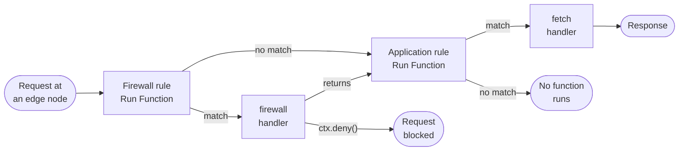
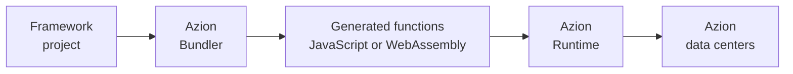

import Code from '~/components/Code/Code.astro'

A function is a handler that runs when a request arrives. The handler receives the request and returns a response, or decides whether the request may continue. [Azion Runtime](/en/documentation/runtime/overview/) starts the handler on demand on the edge node that received the request. It stops the handler when the response is sent, so there is no server to provision or scale.

On Azion, three objects realize that behavior. [Functions](/en/documentation/build/functions/) stores the code as a function. A function instance binds that function to an [application](/en/documentation/build/applications/) or a [firewall](/en/documentation/secure/firewall/) and carries the arguments the code reads. A rule in [Rules Engine](/en/documentation/build/applications/reference/rules-engine/) selects the requests that reach the instance. The following sections cover the request path, function instances, handlers and the event model, and framework builds through Azion Bundler.

## Request path

A request reaches a function only through a rule that names its instance. The diagram traces one request from the edge node that received it, through the firewall and the application, to the response.

The firewall's Rules Engine sees the request first. When a firewall rule with the **Run Function** behavior matches, [Azion Runtime](/en/documentation/runtime/overview/) runs the `firewall` handler of the bound instance in the request phase. A call to `ctx.deny()` blocks the request immediately, and the `fetch` handler never runs for it. When the handler returns without that call, the firewall's Rules Engine resumes where the behavior was triggered, and the request continues to the application.

The application's Rules Engine then applies its own rules, and a **Run Function** rule whose criteria match runs the `fetch` handler of the selected instance. That handler returns a `Response` to the client. A request that matches no firewall rule goes straight to the application's rules, and a request that matches no application rule runs no function.

A rule decides which requests a handler sees. An application rule can select requests by path, such as `${uri}` equal to `/hello-world`. On the firewall, a rule can select them by a network list of countries. The `firewall` handler can also read request metadata, such as the client's country or IP address, before it decides. For the metadata fields, refer to [Metadata API](/en/documentation/products/applications/functions/runtime/api-reference/metadata/).

Nothing on this path is automatic. A saved function runs nothing by itself, and an instance runs nothing until a rule names it in a **Run Function** behavior. The application or firewall must also have its **Functions** module enabled before it can hold an instance. A function that never runs is usually missing one link in that chain: the module, the instance, or a rule whose criteria the request meets.

The price of this design is configuration: three objects, each created separately, before a single request reaches your code. In return, the same function can sit behind several rules. A rule also filters traffic before the handler runs, so the code does not inspect every request itself. A request the firewall denies never reaches the application's rules, so the application does no work for it.

---

## Function instances

The same code often has to run in several places with different settings. A function instance binds one saved function to one application or one firewall and carries the arguments that make this binding differ from the next. The code is not editable at instantiation, so an instance changes what the function receives, never what it does.

The arguments are a JSON object. The function definition can carry default arguments, and the instance's arguments override them key by key, so the handler receives the merged object. A rule's **Run Function** behavior points at an instance, not at a function. That indirection is what lets one function sit behind several rules, each with its own arguments. You change behavior through the arguments and leave the code alone, and one function serves several applications.

The price is indirection. A rule names an instance and the instance names a function, so a reader of the rule follows two links to reach the code. You set an argument that differs per application on each instance. A change in logic is a change to the function, never to an instance.

An args object above 100 KB fails at instantiation, so the ceiling bounds how much configuration one instance carries. For the full set of limits, refer to [Functions limits](/en/documentation/build/functions/limits/). For the instance fields and how defaults and overrides merge, refer to [Functions Instances](/en/documentation/build/functions/reference/functions-instances/).

---

## Handlers and the event model

[Azion Runtime](/en/documentation/runtime/overview/) calls your code through a fixed entry point. A function therefore ships as an ES module whose default export is an object with named handlers. The `fetch` handler answers a request, and the `firewall` handler decides whether a request may continue. The runtime calls the handler that matches the event and passes it the request.

A module that carries both handlers looks like this:

<Code lang="javascript" code={`export default {
  fetch: async (request, env, ctx) => {
    return new Response('Access granted');
  },

  firewall: async (request, env, ctx) => {
    const userAgent = request.headers.get('User-Agent');

    // Block bot requests
    if (userAgent && userAgent.includes('bot')) {
      ctx.deny();
      return;
    }

    // Allow request to continue to fetch handler
    return;
  }
};`} />

Each handler receives the same three parameters. `request` is the Web `Request` object for the incoming HTTP request, and `env` holds environment variables and bindings. `ctx` is the execution context, and it carries the two calls that shape the event model.

A function executes inside an execution context, an isolate, which holds the heap, the stack, and every runtime allocation the code makes. Before a function handles its first request, it initializes, and that initialization time is its cold start. The memory an isolate holds and the time a cold start takes each have a ceiling. For the values, refer to [Functions limits](/en/documentation/build/functions/limits/).

A `fetch` handler returns a `Response`, and the function's lifetime ends with it. Work that must outlive the response, such as a log write, goes into `ctx.waitUntil(promise)`, which extends the function's lifetime so the task completes. A `firewall` handler returns nothing: it calls `ctx.deny()` to block the request immediately, or it returns to let the request continue to the `fetch` handler.

The entry-point contract is fixed, and that is the tradeoff. A module that exports a bare function, exports named handlers, or exports nothing matches no supported pattern. Such code fails with the error `Unsupported handler pattern detected`. The Service Worker form, which registers handlers with `addEventListener`, remains supported for backward compatibility. Azion recommends the ES Modules form for new code and migration for existing code. For the parameter tables, the migration mapping, and the unsupported shapes, refer to [Handlers](/en/documentation/build/functions/reference/handlers/).

---

## Framework builds through Azion Bundler

A web framework project is not a handler module. Its server-side logic, API routes, and middleware follow the framework's own conventions rather than the handler contract. [Azion Bundler](https://github.com/aziontech/bundler), an open-source framework adapter, transforms that code into functions that run on [Azion Runtime](/en/documentation/runtime/overview/).

The diagram shows the pipeline from project to data center. The bundler works in four stages:

1. **Framework detection.** When you initialize a project with [Azion CLI](/en/documentation/products/azion-cli/overview/), the bundler identifies the framework and applies the matching adapter.
2. **Code transformation.** The bundler converts the framework's server-side logic, API routes, and middleware into functions compatible with Azion Runtime.
3. **Function generation.** Each route, API endpoint, or server component becomes a function that runs independently.
4. **Deployment.** Azion distributes the functions across its network, where they run like any other function.

The deployed artifact is a set of generated functions, not the files you wrote. You debug those functions, not the source files, with [Preview Deployment](/en/documentation/products/applications/functions/runtime-api/preview-deployment/), [Data Stream](/en/documentation/observe/data-stream/guides/debugging-functions-data-stream/), or the [GraphQL API](/en/documentation/build/functions/guides/debugging-functions-graphql/). Framework code reaches environment variables through the [environment variables API](/en/documentation/products/functions/environment-variables/).

Each generated function is billed as a function: compute time and invocations carry charges, so a framework with many routes deploys many billable functions. For the rates, refer to [Pricing](/en/documentation/platform/pricing/#functions). For the supported frameworks, refer to [Frameworks compatibility](/en/documentation/products/devtools/azion-edge-runtime/frameworks-compatibility/).

---

## Related resources

- [Handlers](/en/documentation/build/functions/reference/handlers/) - The parameter tables for `fetch` and `firewall`, both handler patterns, and the migration mapping.
- [Functions Instances](/en/documentation/build/functions/reference/functions-instances/) - The instance fields, the JSON args, and how defaults and overrides merge.
- [Functions limits](/en/documentation/build/functions/limits/) - Every limit that applies to a function, with its unit.
- [Functions quickstart](/en/documentation/build/functions/quickstart/) - The function, instance, and rule chain built once, end to end.
- [Rules Engine](/en/documentation/build/applications/reference/rules-engine/) - The criteria and behaviors a rule uses to select requests, including **Run Function**.
- [Functions for Firewall](/en/documentation/secure/firewall/reference/functions/) - The request-phase behavior of a function bound to a firewall.
- [Azion Runtime](/en/documentation/runtime/overview/) - The runtime that executes functions and the Web APIs it exposes.
- [Functions guides and tutorials](/en/documentation/build/functions/guides/) - The how-tos that apply this model, from a first instance to debugging.
