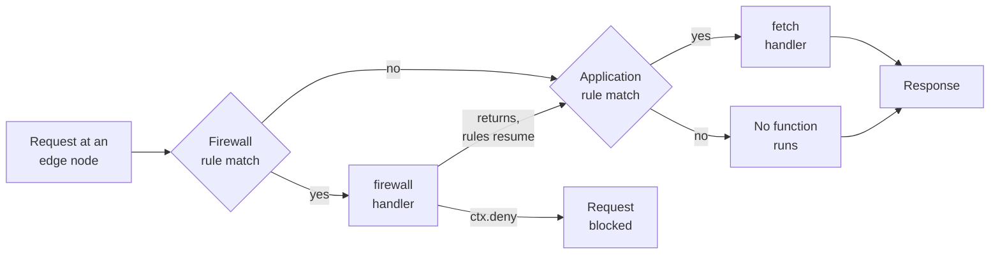
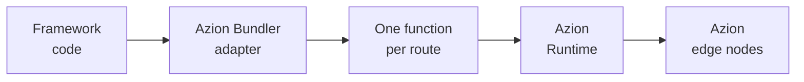

import Code from '~/components/Code/Code.astro'

A function is a handler that Azion runs when a request arrives: it receives the request and returns a response, on infrastructure Azion operates. [Azion Runtime](/en/documentation/runtime/overview/) starts the handler on demand on the edge node that received the request, so the code runs close to the user. Three Azion objects decide which requests reach it. **Functions** stores the code. A function instance binds it to an application or a firewall and carries its arguments, and [Rules Engine](/en/documentation/build/applications/reference/rules-engine/) selects the requests that trigger it.

The sections that follow trace that behavior in order: the request path, function instances, handlers and the event model, and framework builds through Azion Bundler.

## Request path

A request that arrives at an Azion edge node runs a function only where a rule selects it. Rules Engine evaluates its criteria against the request, and a matching rule triggers the behavior that invokes the function instance. Azion Runtime processes the function and returns an outcome, and Rules Engine resumes processing from the point the behavior was triggered.

The path has two points where a function can run, and they are not interchangeable. A function on a firewall runs in the request phase, and it either blocks the request or lets it continue to the `fetch` handler. A function on an application runs where its rule says: the **Run Function** behavior carries both the execution phase and the criteria that trigger it.

The diagram below follows one request from the edge node to the response. Each decision is a criteria match in Rules Engine, and each box that names Azion Runtime is one handler invocation:

Nothing on this path is automatic. Code saved in **Functions** and never instantiated, or instantiated and never named by a rule, is code that no request reaches.

## Function instances

A function instance is the object that binds one function to one application or one firewall. You create the function in **Functions** and save it first; instantiation comes after. The instance does not copy the code and cannot change it. What the instance carries is the arguments, in JSON, that Azion Runtime passes to the function's execution context.

That split is what makes one function reusable. The same code runs in several applications, and each instance varies the behavior through its own **Args** value, up to 100 KB. An **Args** object above that limit causes the function to fail at instantiation.

An instance is still not a trigger. A rule in Rules Engine, carrying the **Run Function** behavior, decides which requests reach the instance and in which execution phase. For the fields an instance holds, refer to [Functions Instances](/en/documentation/build/functions/reference/functions-instances/). For the firewall equivalent, refer to [Functions Instances for Firewall](/en/documentation/secure/firewall/reference/functions-instances/).

## Handlers and the event model

A function exports handlers rather than a single entry point. In the ES Modules pattern, which Azion recommends, the module's default export is an object whose named methods are the handlers. `fetch` answers HTTP requests, and `firewall` carries security logic. Azion Runtime calls the handler that matches the event, so one module can hold both and answer at two different points on the request path.

Both handlers take the same three parameters: the incoming `Request`, an `env` object that holds environment variables and bindings, and a `ctx` execution context. `ctx` is where the event model becomes visible. `ctx.waitUntil(promise)` extends the function's lifetime for async tasks, and `ctx.deny()` blocks a request from inside a firewall handler.

One module carrying both handlers looks like this:

<Code lang="javascript" code={`
export default {
  fetch: async (request, env, ctx) => {
    return new Response('Access granted');
  },

  firewall: async (request, env, ctx) => {
    const userAgent = request.headers.get('User-Agent');

    // Requests that identify themselves as bots never reach fetch
    if (userAgent && userAgent.includes('bot')) {
      ctx.deny();
      return;
    }

    return;
  }
};
`} />

The contract is fixed, and the cost of that is portability. A plain default-exported function, a named `export function fetch`, and a module with no export at all are all unsupported. Code shaped that way fails with `Unsupported handler pattern detected`. The body of a function is ordinary JavaScript, but the entry point is not portable: code that exposes its handler in another shape has to be rewritten before it runs.

The Service Worker pattern, built on `addEventListener('fetch', ...)`, still runs and is kept for backward compatibility. Azion recommends migrating those functions to ES Modules. For the parameter tables of both patterns, refer to [Handlers](/en/documentation/build/functions/reference/handlers/).

---

## Application functions and firewall functions

The two placements differ in what the handler is allowed to decide. An application function answers a request: the `fetch` handler receives the `Request`, and its return value is the `Response` the client gets. A firewall function decides whether the request continues at all, and it runs in the request phase.

Control flow around a firewall function needs care, because the handler does not have to return anything. The `firewall` handler blocks a request by calling `ctx.deny()`. When it returns without calling `ctx.deny()`, the request continues to the `fetch` handler. A handler that reaches its end with neither outcome intended is therefore an allow decision, taken by omission.

Two shapes cause that:

- **A conditional with no `else`.** A branch that calls a finishing outcome and then falls through to the code after the `if` can behave unexpectedly. Pair the branches with `else`, or end each branch with its own `return`.
- **A promise nobody waits on.** Async work started inside a handler and left unattended may end in unexpected exceptions. Pass it to `waitUntil`, which extends the function's lifetime for async tasks.

Functions on a firewall also read request metadata. The metadata covers GeoIP location, the remote client address and port, the server protocol, TLS ciphers and fingerprints, and per-request identifiers. For the field names, refer to [Metadata API](/en/documentation/products/applications/functions/runtime/api-reference/metadata/). For the firewall side of the product, refer to [Functions for Firewall](/en/documentation/secure/firewall/reference/functions/).

---

## Framework builds through Azion Bundler

A web framework project becomes functions before it runs. When you deploy such a project on Azion, [Azion Bundler](https://github.com/aziontech/bundler) transforms the framework code into functions that run on Azion Runtime. Azion Bundler is an open-source framework adapter built for Azion's distributed architecture. It stands between the project you wrote and the code the platform executes.

The pipeline runs in one direction, from your framework project to the nodes that answer requests:

Four stages produce that result:

1. **Framework detection.** When you initialize a project with [Azion CLI](/en/documentation/products/azion-cli/overview/), the bundler identifies the framework and applies the matching adapter.
2. **Code transformation.** The bundler converts the framework's server-side logic, API routes, and middleware into functions compatible with Azion Runtime.
3. **Function generation.** Each route, API endpoint, and server component becomes a function that executes independently.
4. **Deployment.** The generated functions are distributed across Azion's global network.

The tradeoff is that the deployed artifact is no longer the code you wrote. Debugging goes through [Preview Deployment](/en/documentation/products/applications/functions/runtime-api/preview-deployment/), [Data Stream](/en/documentation/observe/data-stream/guides/debugging-functions-data-stream/), or the [GraphQL API](/en/documentation/build/functions/guides/debugging-functions-graphql/). Generated functions are also functions for billing, because they incur compute time and invocation charges. For the charges, refer to [Pricing](/en/documentation/platform/pricing/#functions). For which frameworks the adapters cover, refer to [Frameworks compatibility](/en/documentation/products/devtools/azion-edge-runtime/frameworks-compatibility/).

---

## Function inputs

A function reads from four inputs: the request, environment variables, the arguments set on its instance, and, on a firewall, request metadata. The first three carry size limits:

| Input | How it reaches the function | Limit |
| --- | --- | --- |
| Request | The `request` parameter, a standard `Request` object | URL 16 KB, headers 64 KB combined |
| Environment variables | The `env` parameter | 32 KB for all variables of a function combined |
| Args | Set on the function instance, in JSON | 100 KB |

Request bodies are capped separately by service plan: 100 MB on Developer, 200 MB on Business, and 500 MB on Enterprise and Mission Critical.

**Args** exist so that one function behaves differently in each place it is instantiated. You set them as a JSON object on the instance, and the code does not change. In the Service Worker pattern, code reads a single argument as a property of `event.args`, such as `event.args.desiredArg`.

Environment variables hold configuration and sensitive values that do not belong in the source code. For how to set and read them, refer to [Environment variables](/en/documentation/products/functions/environment-variables/). For what the runtime itself exposes to your code, refer to [Supported Web APIs](/en/documentation/runtime-apis/javascript/).

## Execution limits

An invocation runs inside a fixed envelope. These are the default limits that bound a running function:

| Scope | Limit | What it measures |
| --- | --- | --- |
| Max CPU Execution Time | 2s | Active computation per invocation, not wall-clock time. A function that exceeds it is terminated |
| Max Execution Time | 5 min | Total elapsed time for an invocation, including I/O wait, `fetch()` calls, and async operations |
| Max Cold Start | 2s | Time allowed for a function to initialize before it handles its first request |
| Sub-Requests | 50 Sub-Req | Outbound `fetch()` calls a function can make during a single invocation |
| Memory per Isolate | 512 MB | Memory available to a single function execution context, a V8 isolate, including heap, stack, and all runtime allocations |

The two time limits measure different things, and the difference decides what a function can do. A function may wait minutes on a slow origin and stay inside its 5-minute budget, while 2 seconds of computation ends it. The CPU ceiling counts active computation only, so time spent inside `fetch()` calls and other I/O does not consume it.

The other three limits bound shape rather than time. A function can make at most 50 outbound `fetch()` calls in one invocation, which bounds how many upstream services one request can aggregate. The memory ceiling covers heap, stack, and every other allocation in the isolate, so 512 MB bounds the whole execution context and not only your data. Initialization is bounded rather than absent: a function is allowed up to 2 seconds to start before it handles its first request.

:::tip
You can request an increase to these limits based on your plan. Contact the [technical support team](/en/documentation/services/support/) to request it.
:::

For the complete set, including the authoring and input limits, refer to [Functions limits](/en/documentation/build/functions/limits/).

---

## Related resources

- [Handlers](/en/documentation/build/functions/reference/handlers/) - the parameter tables for the `fetch` and `firewall` handlers in both patterns.
- [Functions Instances](/en/documentation/build/functions/reference/functions-instances/) - the fields an instance carries and how arguments are set.
- [Functions limits](/en/documentation/build/functions/limits/) - every default limit in one table, with the plan variations.
- [Functions quickstart](/en/documentation/build/functions/quickstart/) - create, instantiate, and trigger a first function.
- [Rules Engine](/en/documentation/build/applications/reference/rules-engine/) - how criteria and the **Run Function** behavior select requests.
- [Functions for Firewall](/en/documentation/secure/firewall/reference/functions/) - what a function can do in the request phase of a firewall.
- [Azion Runtime](/en/documentation/runtime/overview/) - the runtime your functions execute on.
- [Guides and tutorials](/en/documentation/build/functions/guides/) - working examples of the mechanisms on this page.
