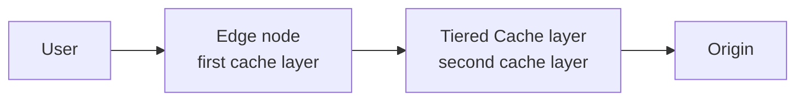

**Tiered Cache** is a [Cache](/en/documentation/build/cache/) module that adds a second cache layer between Azion edge nodes and your origin. An edge node that lacks a requested object asks the Tiered Cache layer before the origin, so objects stay in cache for longer. The module requires activation for your account through the Sales team, and then a module switch on each application that uses it. For the generic mechanism, refer to [tiered caching in the Learning Center](https://www.azion.com/en/learning/cdn/what-is-tiered-caching/).

With the module active, a request passes through two cache layers before it reaches the origin:

The edge node answers from its own cache when it holds the object. Otherwise it asks the Tiered Cache layer, and the layer queries the origin only when its own copy is missing or expired. The full lookup path, with the cache status values, is in [How Cache works](/en/documentation/build/cache/how-it-works/).

---

## Activation

Tiered Cache is available only after the Sales team activates the service for your account. With the service active, you turn the module on or off per application in the **Main Settings** tab, provided no existing dependency blocks the deactivation. A cache setting then keeps objects in the layer only when its TTL meets the minimum.

| Scope | Requirement |
| --- | --- |
| Account | Service activation by the [Sales team](https://www.azion.com/en/contact-sales/) |
| Application | The **Tiered Cache** module turned on in the [Main Settings](/en/documentation/build/applications/reference/main-settings/) tab |
| Cache setting | A TTL of at least 3 seconds |

Turning the module on can generate usage-related costs. For the rates, refer to [Pricing](/en/documentation/platform/pricing/).

[WebSocket Proxy](/en/documentation/build/applications/reference/websocket/) is incompatible with the Cache and Tiered Cache modules, so an application that uses WebSocket Proxy cannot use the layer.

## TTL

A cache setting keeps objects in the Tiered Cache layer only when its TTL is 3 seconds or more. Below that value, the cache setting cannot use the module. The layer holds an object for at most 2,592,000 seconds. The edge cache TTL of a cache setting has its own bounds, with a default of 60 seconds.

| Scope | Value |
| --- | --- |
| Minimum TTL of a cache setting with Tiered Cache | 3 seconds |
| Maximum TTL in the Tiered Cache layer | 2,592,000 seconds |
| Default TTL of a cache setting | 60 seconds |

For the bounds of the edge cache TTL, refer to [Cache limits](/en/documentation/build/cache/limits/). To set the TTL of a cache setting, refer to [Cache Settings](/en/documentation/build/cache/reference/cache-settings/).

## Regions

The servers of the Tiered Cache layer are hosted in the United States by default. Azion also hosts them in Brazil, so you can keep the layer closer to your users. A region change for an application goes through the Sales team.

| Region | Identifier | Default |
| --- | --- | --- |
| United States | `na-united-states` | Yes |
| Brazil | `sa-brazil` | No |

To switch an application between regions, contact the [Sales team](https://www.azion.com/en/contact-sales/).

---

## Large File Optimization

[Large File Optimization](/en/documentation/build/cache/reference/cache-settings/) fragments a large file and caches each fragment on demand, as the user consumes it. With the Tiered Cache module active, the feature applies to the Tiered Cache layer as well as the edge cache layer. In the Azion CLI, `--slice-configuration-enabled` turns the feature on and `--slice-l2-caching-enabled` extends it to the Tiered Cache layer.

## Real-Time Purge

[Real-Time Purge](/en/documentation/build/cache/reference/real-time-purge/) removes an object from the Tiered Cache layer before its TTL ends. Purge the Tiered Cache layer first and the edge cache layer, **Cache**, second. In the reverse order, an edge node can fetch the outdated copy back from the layer. The Tiered Cache layer is available as a purge layer only while the module is active.

| Purge type | Reaches the Tiered Cache layer |
| --- | --- |
| URL purge | Yes |
| Cache key purge | Yes |
| Wildcard purge | No |

Fragments created by Large File Optimization leave the layer through a cache key purge that lists each fragment, since a wildcard purge does not reach it. For the argument formats and the purge limits, refer to [Real-Time Purge](/en/documentation/build/cache/reference/real-time-purge/). To run a purge, refer to [Purge cached content](/en/documentation/build/cache/guides/purge-content/).

## Bypass Cache

The [Bypass Cache](/en/documentation/build/applications/reference/rules-engine/#bypass-cache) behavior of Rules Engine sends a request to the origin instead of the edge cache. The behavior does not reach the Tiered Cache layer. An application with the module active keeps caching in that layer for the minimum TTL, even when a Bypass Cache rule matches the request.

---

## Interfaces

The Console switch controls the module for the whole application. The API key, the CLI flags, and the configuration keys apply to one cache setting.

| Interface | Setting |
| --- | --- |
| Azion Console | The **Tiered Cache** module in the **Main Settings** tab of the application. |
| API | `modules.tiered_cache.topology` in the cache setting request body: `"near-edge"` or `"near-origin"` (if supported). |
| Azion CLI | `--l2-caching-enabled` on `azion create cache-setting` turns the module on for the cache setting; `--slice-l2-caching-enabled` turns on Large File Optimization for the Tiered Cache layer. |
| `azion.config.js` | `tieredCache: { enabled, topology }` in an `AzionCache` object; `topology` accepts `'nearest-region'`, `'br-east-1'`, or `'us-east-1'`. |

For the flags, refer to [azion create](/en/documentation/devtools/cli/create/). For the configuration file, refer to [azion.config.js](/en/documentation/devtools/cli/configs/azion-config-js/).

## Usage data

The `workloadConsumptionMetrics` dataset of the GraphQL Consumption API reports the requests and the data transferred by Tiered Cache for up to 24 months.

| Field | Value |
| --- | --- |
| Dataset | `workloadConsumptionMetrics` |
| `productId` | `1564082375` |
| `metricName` | `requests`, `data_transferred_total` |
| Retention | Up to 24 months |

For the query, refer to [Query Tiered Cache usage data with GraphQL](/en/documentation/products/guides/query-tiered-cache-usage-data-with-graphql/). Real-Time Events records each request to an application that uses Tiered Cache in its Tiered Cache dataset. For the fields, refer to [Real-Time Events](/en/documentation/observe/real-time-events/).

---

## Limits

:::tip
**Increase limits**   
You can request to increase the limits based on your plan. Contact the [technical support team](/en/documentation/services/support/) to request it.
:::

These are the **default limits**:

| Scope | Limit |
| --- | --- |
| Minimum TTL in Tiered Cache | 3 seconds |
| Maximum TTL in Tiered Cache | 2,592,000 seconds |

For every Cache limit by plan, refer to [Cache limits](/en/documentation/build/cache/limits/).

## Related resources

- [How Cache works](/en/documentation/build/cache/how-it-works/) - the lookup path through both cache layers, the cache status values, and expiration.
- [Cache Settings](/en/documentation/build/cache/reference/cache-settings/) - every field of a cache setting, including the TTL modes and Large File Optimization.
- [Real-Time Purge](/en/documentation/build/cache/reference/real-time-purge/) - the purge types, their argument formats, and the purge limits.
- [Cache limits](/en/documentation/build/cache/limits/) - every Cache limit, by plan.
- [Configure a cache policy](/en/documentation/build/cache/guides/cache-settings/) - create the cache setting that the module applies to.
- [Purge cached content](/en/documentation/build/cache/guides/purge-content/) - the steps to run a purge.
- [Main Settings](/en/documentation/build/applications/reference/main-settings/) - the module switches of an application.
