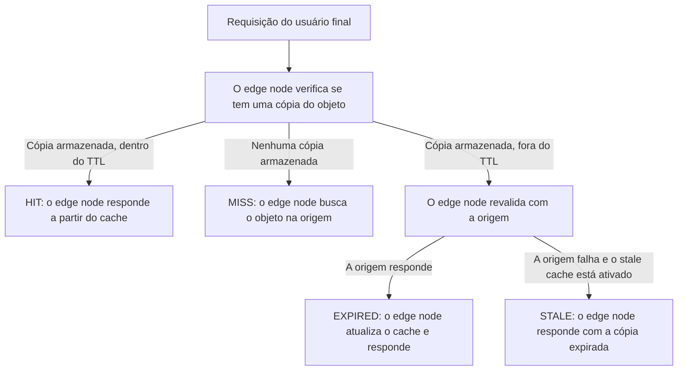

**Cache** armazena conteúdo nos edge nodes da Azion, em uma camada entre seus servidores de origem e o usuário final. Quando o edge node tem uma cópia válida, ele responde a partir dessa camada e a requisição não chega à origem. Sem essa cópia, o edge node busca o objeto na origem.

Cinco mecanismos produzem esse resultado: a busca no cache, o status de cache, a proteção da origem, a expiração e o stale cache.

## Busca no cache

A busca no cache acontece no edge node que recebe a requisição, antes de qualquer conexão com a origem. Um edge node com uma cópia válida responde de imediato. Se a cópia não existe ou passou do TTL, o edge node vai até a origem, e a resposta da origem decide o restante.

Uma requisição segue um de quatro caminhos:



Duas perguntas definem o caminho. A primeira é se o edge node tem uma cópia do objeto; a segunda é se essa cópia continua dentro do TTL. Uma cópia armazenada dentro do TTL produz um HIT, e a ausência de cópia produz um MISS. O terceiro caso, uma cópia fora do TTL, entrega a decisão à origem. EXPIRED vem depois que a origem responde; se ela falha e o stale cache está ativado, o resultado é STALE.

## Status de cache

Os edge nodes da Azion informam um status de cache para cada busca, e o cabeçalho de requisição `Pragma: azion-debug-cache` torna esse status visível. A resposta então traz `X-Cache`, que nomeia o status, o IP do edge node e o protocolo:

```
X-Cache: HIT from 200.000.000.00 with HTTP/2.0
```

Oito valores podem aparecer nesse cabeçalho:

| Status | Significado |
| --- | --- |
| `HIT` | Conteúdo válido e atualizado é fornecido diretamente do cache do edge node. |
| `MISS` | O conteúdo não é encontrado no cache do edge node e é buscado na origem. A resposta pode ser armazenada em cache para requisições futuras. |
| `EXPIRED` | O conteúdo em cache passou do TTL definido no edge node. Quando a origem responde, o conteúdo em cache é atualizado para requisições futuras. |
| `STALE` | Ao optar por servir stale cache, se a origem falha em responder e o cache do edge node expirou, uma versão obsoleta é servida. |
| `UPDATING` | O conteúdo em cache expirou e o stale cache está sendo servido, mas o conteúdo está sendo atualizado na origem. |
| `REVALIDATED` | O conteúdo em cache é verificado contra o da origem usando cabeçalhos condicionais. Se ainda estiver atualizado, o recurso não é retransmitido. |
| `BYPASS` | O edge node solicita o conteúdo diretamente da origem em vez de usar uma versão em cache, porque o comportamento [Bypass Cache](/pt-br/documentacao/build/applications/reference/rules-engine/#bypass-cache) está ativo. |
| `-` | Nenhum status é recebido e o conteúdo está restrito de armazenamento em cache. Por exemplo, uma requisição `POST` com [Caching for POST](/pt-br/documentacao/build/cache/reference/cache-settings/#cache-de-metodos-http) desabilitado não é registrada. |

---

## Proteção da origem

Um MISS envia a requisição à origem, então a origem recebe carga sempre que o cache não pode responder. A Azion limita essa carga de duas formas.

Os edge nodes da Azion mantêm conexões keep-alive com a origem sempre que possível, o que reduz a sobrecarga de handshakes TCP/IP frequentes. Atualizações de cache e respostas de MISS usam essas conexões.

O controle de Thundering Herd cobre o caso de picos. Diante de várias requisições simultâneas pelo mesmo objeto não armazenado em cache, apenas uma conexão com a origem é aberta. Cada edge node solicita o objeto à origem uma vez por MISS, ou uma vez por qualquer outro status não-HIT.

## Expiração

Dois TTLs decidem por quanto tempo uma cópia em cache continua utilizável. O TTL de cache do navegador vale para os navegadores locais, onde um valor maior reduz as buscas e a banda que elas consomem. Nos edge nodes da Azion, o TTL de cache faz o mesmo trabalho, e aumentá-lo reduz a carga que chega à origem.

Os dois ajustes trocam atualidade por carga. Um TTL curto mantém a cópia em cache próxima do que a origem serve, ao custo de mais requisições à origem. Aumente qualquer um dos valores e o inverso acontece: menos requisições chegam à origem, e o usuário pode receber uma cópia que já não corresponde à origem.

---

## Stale cache

O stale cache permite que os edge nodes respondam com um objeto depois que ele expira. O usuário final recebe uma cópia expirada em vez de uma página de erro, enquanto uma versão atualizada é buscada. **Enable Stale Cache**, em uma [cache setting](/pt-br/documentacao/build/cache/reference/cache-settings/), ativa o comportamento.

Um objeto expirado é reutilizado quando a revalidação falha por um destes motivos:

- A origem retorna um erro 5xx.
- A conexão expira por timeout, ou a origem está inacessível.
- Os cabeçalhos cache-control são inválidos ou estão ausentes.
- Uma atualização do objeto está em andamento, então a revalidação ainda está em curso.

A duração da janela de stale vem da diretiva `stale-while-revalidate=<ttl>`. Com **Honor Origin Cache**, o valor enviado pela origem define a janela. A Azion aplica um padrão de 300 segundos (5 minutos) quando a cache setting usa **Override Cache Settings**, ou quando a origem omite a diretiva.

Durante a janela, o edge node serve a cópia expirada de imediato e busca uma versão atualizada em segundo plano. Essa janela tem um custo: enquanto ela durar, o usuário final lê conteúdo que a origem já não serve.

---

## Recursos relacionados

- [Cache](/pt-br/documentacao/build/cache/) - o que o produto armazena em cache e quais configurações controlam isso.
- [Cache Settings](/pt-br/documentacao/build/cache/reference/cache-settings/) - os campos que definem os dois TTLs e o stale cache.
- [Cache keys](/pt-br/documentacao/build/cache/reference/cache-keys/) - o que faz duas requisições corresponderem ao mesmo objeto em cache.
- [Tiered Cache](/pt-br/documentacao/build/cache/tiered-cache/) - uma segunda camada de cache entre os edge nodes e a origem.
- [Quickstart do Cache](/pt-br/documentacao/build/cache/quickstart/) - crie a sua primeira cache setting.
- [Verifique indicadores de cache no navegador](/pt-br/documentacao/build/cache/guides/verificar-tempo-de-cache-da-pagina/) - leia o cabeçalho `X-Cache` em uma requisição real.
