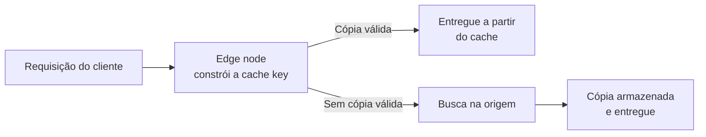
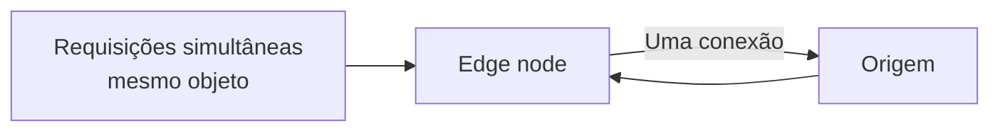
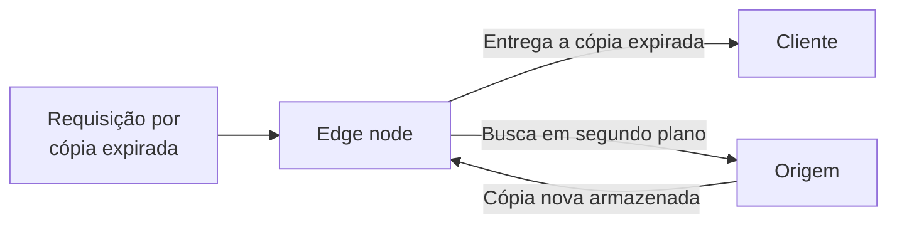
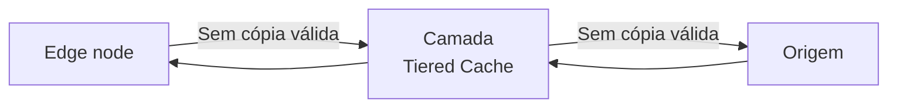
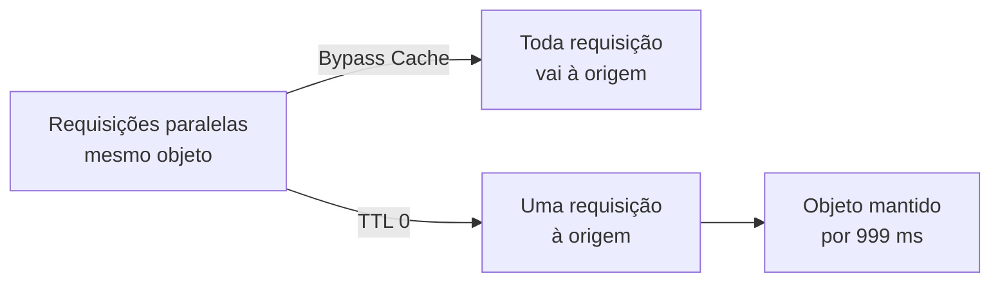

Um cache guarda uma cópia de uma resposta perto das pessoas que a pedem. Quando um navegador requisita um objeto, o edge node mais próximo dele verifica se já tem uma cópia válida. Se tiver, o edge node responde a partir dessa cópia e a requisição nunca chega à sua origem. Se não tiver, o edge node busca o objeto na origem, entrega o objeto e guarda uma cópia para a próxima requisição. O restante do comportamento é um conjunto de regras. Elas decidem por quanto tempo essa cópia permanece válida, o que acontece quando a origem não responde e quantas requisições chegam à origem enquanto nenhuma cópia existe.

Na Azion, [Cache](/pt-br/documentacao/build/cache/) é um módulo de [Applications](/pt-br/documentacao/build/applications/) que aplica essas regras em cada edge node da rede distribuída da Azion. Um cache setting guarda as regras de um grupo de requisições. Ele define por quanto tempo uma cópia permanece válida, se uma cópia expirada pode ser entregue e quais partes de uma requisição alteram a cache key. Uma regra [Set Cache Policy](/pt-br/documentacao/build/applications/reference/rules-engine/#set-cache-policy) no Rules Engine escolhe o cache setting que uma requisição segue. [Tiered Cache](/pt-br/documentacao/build/cache/tiered-cache/), um módulo de Cache, adiciona uma segunda camada de cache entre os edge nodes e a sua origem. [Real-Time Purge](/pt-br/documentacao/build/cache/reference/real-time-purge/) remove uma cópia antes que ela expire.

Sete mecanismos moldam esse comportamento: caminho da requisição, status do cache, proteção da origem, expiração e revalidação, entrega de conteúdo stale, camada Tiered Cache e Bypass Cache versus TTL 0.

## Caminho da requisição

Para decidir se já tem o objeto que uma requisição pede, o edge node constrói uma cache key. Uma cache key é o identificador que um edge node constrói a partir de uma requisição para decidir se duas requisições correspondem ao mesmo objeto em cache. Cache constrói a chave a partir da URI da requisição e acrescenta um marcador de variação quando o objeto varia por cookie, query string, device group ou formato de imagem. Duas requisições com a mesma cache key compartilham um objeto em cache, e uma chave diferente nomeia um objeto diferente. Para o formato da chave e cada marcador de variação, consulte [Cache keys](/pt-br/documentacao/build/cache/reference/cache-keys/).

O diagrama mostra os dois resultados de uma consulta ao cache. Quando o edge node tem uma cópia válida sob essa chave, ele entrega a cópia e a requisição termina ali. Caso contrário, o edge node encaminha a requisição à origem, entrega a resposta e armazena uma cópia sob a chave para a próxima requisição. Com Tiered Cache ativado, uma segunda camada de cache fica entre o edge node e a origem nesse caminho.

Por padrão, um edge node armazena em cache apenas respostas a requisições `GET` e `HEAD`. Um cache setting pode estender o cache a requisições `POST` e `OPTIONS`, o que adiciona o corpo da requisição à cache key. Para essas opções, consulte [Cache Settings](/pt-br/documentacao/build/cache/reference/cache-settings/).

Uma cópia vive no edge node que a buscou. A primeira requisição de um objeto em cada edge node é, portanto, um MISS, e a origem responde a essa primeira requisição uma vez por edge node. As cache keys também diferenciam maiúsculas de minúsculas, então duas URIs que diferem apenas na caixa das letras são dois objetos em cache.

---

## Status do cache

Toda resposta que um edge node entrega carrega um status do cache que registra como a consulta terminou. O status diz se uma cópia existia, se ela ainda era válida e se a origem participou. Cache usa oito valores:

| Status | Significado |
| --- | --- |
| `HIT` | Uma cópia válida e atualizada foi entregue a partir do edge node. |
| `MISS` | Nenhuma cópia foi encontrada, então o edge node buscou o objeto na origem. A resposta pode ser armazenada para requisições posteriores. |
| `EXPIRED` | A cópia tinha passado do TTL. Quando a origem responde, a cópia armazenada é atualizada. |
| `STALE` | A cópia tinha expirado e a origem não respondeu, então o edge node entregou a cópia expirada. Requer Stale Cache. |
| `UPDATING` | A cópia tinha expirado, uma cópia expirada foi entregue e o objeto está em atualização a partir da origem. |
| `REVALIDATED` | A cópia foi verificada na origem com headers condicionais e ainda estava atualizada, então a origem não a reenviou. |
| `BYPASS` | O edge node enviou a requisição à origem sem usar uma cópia, porque uma regra Bypass Cache se aplica. |
| `-` | Sem status. O objeto tem restrição de cache, por exemplo uma requisição `POST` quando o cache para `POST` está desativado. |

Para ler o status de uma resposta, envie a requisição com o header `Pragma: azion-debug-cache`. O header de resposta `X-Cache` então carrega o status, o IP do edge node e o protocolo da requisição. Para o conjunto completo de headers de depuração, consulte [Cache keys](/pt-br/documentacao/build/cache/reference/cache-keys/). Para lê-los em um navegador, consulte [Verifique indicadores de cache no navegador](/pt-br/documentacao/build/cache/guides/verificar-tempo-de-cache-da-pagina/).

Os mesmos valores chegam aos seus logs como o campo `Upstream Cache Status` em [Real-Time Events](/pt-br/documentacao/observe/real-time-events/) e como a variável `$upstream_cache_status` em [Data Stream](/pt-br/documentacao/observe/data-stream/).

Um status descreve o edge node que respondeu, não a rede inteira. A mesma URL pode retornar `HIT` de um edge node e `MISS` de outro, porque cada edge node mantém as próprias cópias.

## Proteção da origem

Uma cópia ausente ou expirada envia uma requisição à origem, e um objeto popular pode estar ausente em muitos edge nodes no mesmo instante. Dois mecanismos limitam o que a origem recebe nesse caminho.

O primeiro é a própria conexão. Sempre que possível, um edge node mantém a conexão com a origem aberta e a reutiliza em buscas posteriores. Cada conexão reutilizada dispensa um handshake TCP/IP, e a economia é maior durante atualizações do cache e em um MISS, quando a origem é mais acionada.

O segundo é o controle de Thundering Herd. Quando várias requisições pelo mesmo objeto fora do cache chegam a um edge node ao mesmo tempo, o edge node abre apenas uma conexão com a origem. Cada edge node, portanto, consulta a origem uma vez por MISS, ou uma vez por outro status diferente de HIT, independentemente de quantas requisições chegaram juntas.

O diagrama mostra várias requisições por um objeto que chegam a um edge node e saem dele como uma única conexão com a origem.

Os dois mecanismos funcionam por edge node. Um objeto requisitado em toda a rede distribuída da Azion ainda é buscado uma vez por cada edge node que recebe uma requisição por ele. A origem vê uma requisição por edge node, e não uma no total. Tiered Cache reduz isso ainda mais ao colocar uma camada de cache entre os edge nodes e a origem.

---

## Expiração e revalidação

Uma cópia que nunca expirasse entregaria o conteúdo antigo da origem para sempre. Cada cópia, portanto, carrega um TTL, o número de segundos durante os quais o edge node a considera válida. Um cache setting define dois deles. O TTL do cache do navegador controla por quanto tempo um navegador mantém a própria cópia, então um valor maior significa que menos requisições chegam aos edge nodes. O TTL nos edge nodes controla por quanto tempo o edge node mantém a sua cópia, então um valor maior significa que menos requisições chegam à origem.

Para cada TTL, o cache setting honra os headers que a origem envia ou os substitui por um valor que você define. Quando honra a origem, a diretiva `max-age` de `Cache-Control` define o TTL. Quando `Cache-Control` está ausente, o timestamp do header `Expires` o define. Quando o cache setting substitui a origem, o valor que você define se aplica independentemente dos headers que a origem envia. Para os campos que selecionam cada modo, consulte [Cache Settings](/pt-br/documentacao/build/cache/reference/cache-settings/).

Quando o TTL termina, a cópia está expirada, mas não é apagada. A próxima requisição por ela vai à origem com o status `EXPIRED`, e a resposta substitui a cópia armazenada. Uma cópia expirada também pode ser revalidada. O edge node a verifica na origem com headers condicionais, e quando o objeto não mudou a origem não o reenvia. O status é então `REVALIDATED`, e a cópia armazenada continua em uso.

O TTL troca atualidade por carga na origem. Um TTL longo mantém os objetos mais requisitados nos edge nodes e reduz o tráfego para a origem. Um TTL curto mantém os usuários mais próximos do conteúdo atual, ao custo de mais buscas na origem. O TTL nos edge nodes vai de 60 a 31.536.000 segundos, com piso de 0 segundos com [Application Accelerator](/pt-br/documentacao/build/application-accelerator/) e piso de 3 segundos com Tiered Cache. Para cada limite por plano, consulte [Limites do Cache](/pt-br/documentacao/build/cache/limites/).

A expiração não é a única forma de uma cópia sair do cache. Quando você atualiza um objeto na origem, os edge nodes continuam a entregar a cópia armazenada até o TTL terminar. Real-Time Purge remove a cópia dos edge nodes ou da camada Tiered Cache, então a próxima requisição busca a versão mais recente na origem. Para os tipos de purge e seus argumentos, consulte [Real-Time Purge](/pt-br/documentacao/build/cache/reference/real-time-purge/).

## Entrega de conteúdo stale

Uma cópia expirada normalmente significa uma ida à origem. Quando a origem retorna um erro ou não responde, essa ida falha, e sem um fallback o usuário recebe uma página de erro. Stale Cache permite que o edge node entregue a cópia expirada enquanto busca uma nova.

Stale Cache vem habilitado por padrão em um cache setting. Quando está ativo, uma cópia expirada pode ser reutilizada se uma tentativa de revalidação falhar. As causas são:

- Um erro 5xx retornado pela origem.
- Um time-out de conexão ou uma origem inacessível.
- Um header cache-control inválido ou ausente.
- Uma atualização já em andamento para o objeto.

A duração da janela stale vem da diretiva `stale-while-revalidate=<ttl>`, que o edge node procura primeiro. Quando o cache setting honra os headers da origem e a origem envia a diretiva, esse valor define por quanto tempo o objeto pode ser entregue stale. Quando o cache setting substitui os headers da origem, ou a origem omite a diretiva, a janela é de 300 segundos.

O diagrama mostra as duas coisas que o edge node faz ao mesmo tempo durante a janela stale. Ele responde ao cliente imediatamente a partir da cópia expirada e busca uma versão nova na origem em segundo plano. O status é `STALE` quando a origem não respondeu e `UPDATING` enquanto a atualização está em andamento. Depois que o novo objeto é armazenado, as requisições seguintes o recebem.

O preço é a idade. Durante a janela stale, um usuário pode receber conteúdo mais antigo que o TTL, pelo tempo que a janela durar. Quando um erro é preferível a uma cópia antiga, remova o objeto com o método `DEL` em vez de Real-Time Purge. A próxima requisição `GET` então vai à origem, e quando a origem está inacessível o edge node entrega uma página de erro em vez de um objeto stale. Para a opção que desativa Stale Cache, consulte [Cache Settings](/pt-br/documentacao/build/cache/reference/cache-settings/).

---

## Camada Tiered Cache

A proteção da origem funciona por edge node, então um objeto que muitos edge nodes requisitam é buscado na origem uma vez por cada um deles. Tiered Cache adiciona uma segunda camada de cache entre os edge nodes e a sua origem para absorver essas buscas.

Quando um edge node não tem uma cópia válida, ele consulta a camada Tiered Cache antes de consultar a origem. Só quando a camada Tiered Cache também não tem uma cópia válida a requisição chega à origem, e a resposta então preenche as duas camadas no caminho de volta. A camada Tiered Cache mantém o conteúdo em cache por mais tempo que os edge nodes, e seus servidores ficam em uma região escolhida para a sua conta.

O diagrama mostra o caminho de um miss com Tiered Cache ativado. Um miss no edge node chega primeiro à camada Tiered Cache, e um miss na camada Tiered Cache chega à origem. Menos requisições chegam à origem, o que reduz a carga que seus servidores atendem.

A camada tem condições próprias. Tiered Cache precisa ser ativado para a sua conta pela equipe de Vendas, e um cache setting que o usa tem piso e teto de TTL próprios. A ordem do purge também importa. Faça purge da camada Tiered Cache primeiro e dos edge nodes depois. Caso contrário, os edge nodes se reabastecem com conteúdo desatualizado da camada Tiered Cache. Um purge por wildcard não alcança a camada Tiered Cache, e uma regra Bypass Cache também não. Para ativação, regiões, faixa de TTL e ordem do purge, consulte [Tiered Cache](/pt-br/documentacao/build/cache/tiered-cache/).

## Bypass Cache versus TTL 0

Alguns conteúdos precisam vir da origem em cada requisição. Duas configurações se parecem: uma regra Bypass Cache e um cache setting cujo TTL é de 0 segundos. Os efeitos são diferentes.

Uma regra [Bypass Cache](/pt-br/documentacao/build/applications/reference/rules-engine/#bypass-cache) diz ao edge node para não armazenar em cache a resposta da origem para as requisições que ela corresponde. Toda requisição HTTP e HTTPS que os edge nodes recebem para esse caminho é enviada à origem, e nada é armazenado; o status é `BYPASS`. O edge node ainda mantém suas otimizações de protocolo e a conexão keep-alive com a origem sempre que possível. A regra não tem efeito sobre o cache do navegador, que o behavior Set Cache Policy governa. Bypass Cache é um behavior do Rules Engine e requer Application Accelerator.

Um TTL de 0 segundos mantém a cópia no caminho da requisição. O edge node ainda cria um objeto de cache, e esse objeto vive por 999 milissegundos. Requisições paralelas a um edge node se reduzem a uma única requisição à origem, como no controle de Thundering Herd. O edge node também valida a cópia na origem com `If-Modified-Since`. Quando o objeto não mudou, a origem responde `304 Not Modified` e não reenvia o conteúdo, o que é muito mais rápido que uma transferência completa. Um TTL abaixo do piso padrão requer Application Accelerator; para os valores, consulte [Limites do Cache](/pt-br/documentacao/build/cache/limites/).

O diagrama mostra no que uma rajada de requisições paralelas se transforma em cada configuração. Com Bypass Cache, toda requisição se torna uma requisição à origem. Com TTL 0, a rajada se torna uma única requisição à origem, e o objeto que ela cria vive por 999 milissegundos.

Use Bypass Cache quando cada requisição precisa receber um conteúdo diferente, e aceite que a origem então atende toda requisição. Use TTL 0 quando um conteúdo dinâmico que muda ao longo do tempo pode ser entregue de forma idêntica a todos que o requisitam no mesmo instante. Uma requisição que chega dentro desses 999 milissegundos pode receber a cópia armazenada, o que é o propósito da configuração e o seu limite.

:::note[Nota]
Uma regra Bypass Cache se aplica apenas ao cache nos edge nodes. Uma aplicação com Tiered Cache ativo continua a armazenar em cache na camada Tiered Cache pelo TTL mínimo, mesmo para as requisições que a regra corresponde.
:::

---

## Recursos relacionados

- [Cache Settings](/pt-br/documentacao/build/cache/reference/cache-settings/) - cada campo de um cache setting, incluindo os modos de TTL, Stale Cache e as opções de cache key.
- [Cache keys](/pt-br/documentacao/build/cache/reference/cache-keys/) - o formato da chave, cada marcador de variação e os headers de depuração.
- [Real-Time Purge](/pt-br/documentacao/build/cache/reference/real-time-purge/) - tipos de purge, camadas e formatos de argumento.
- [Tiered Cache](/pt-br/documentacao/build/cache/tiered-cache/) - ativação, regiões, faixa de TTL e ordem do purge para a camada Tiered Cache.
- [Limites do Cache](/pt-br/documentacao/build/cache/limites/) - cada valor de limite, por plano.
- [Quickstart do Cache](/pt-br/documentacao/build/cache/quickstart/) - crie um cache setting e aplique-o com uma regra.
- [Configure uma política de cache](/pt-br/documentacao/build/cache/guides/cache-settings/) - o procedimento no Console para um cache setting e sua regra.
- [Verifique indicadores de cache no navegador](/pt-br/documentacao/build/cache/guides/verificar-tempo-de-cache-da-pagina/) - leia o status do cache e a cache key de uma resposta.
- [Rules Engine](/pt-br/documentacao/build/applications/reference/rules-engine/) - os behaviors Set Cache Policy e Bypass Cache.
