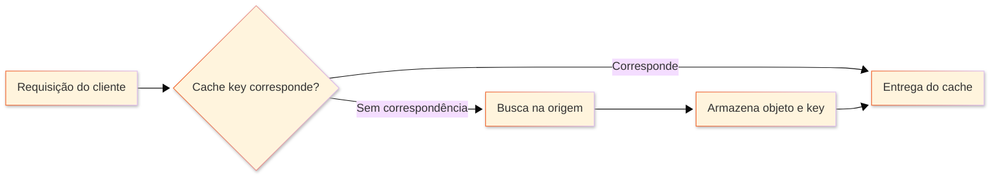
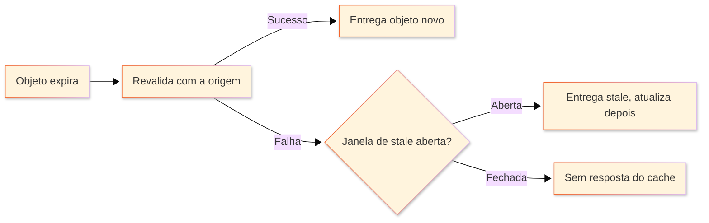

**Cache** armazena uma cópia da resposta no edge node da Azion que a buscou. Esse edge node responde às requisições seguintes pelo mesmo objeto a partir dessa cópia, sem chegar ao servidor de origem. Cache é um módulo de [Applications](/pt-br/documentacao/build/applications/) e fica entre seus servidores de origem e as pessoas que requisitam seu conteúdo.

Um edge node identifica um objeto pela cache key, portanto duas requisições correspondem ao mesmo objeto em cache somente quando constroem a mesma key. Esta página cobre a busca que um edge node executa, o status que ele registra, os mecanismos que protegem a origem, a expiração e o stale cache.

---

## Busca no cache

Um edge node executa a mesma sequência para cada requisição que uma aplicação recebe:



[Rules Engine](/pt-br/documentacao/build/applications/reference/rules-engine/) processa primeiro a fase de request, na qual uma regra pode definir a política de cache que se aplica à requisição. O edge node então constrói a cache key e procura um objeto correspondente. Quando há correspondência, o objeto é entregue direto do cache. Sem correspondência, o edge node encaminha a requisição ao servidor de origem e armazena a resposta. Ele também gera uma cache key para o novo objeto e a retorna no cabeçalho `X-Cache-Key`. Rules Engine processa a fase de response antes de o objeto chegar ao cliente.

[Tiered Cache](/pt-br/documentacao/build/cache/tiered-cache/) adiciona uma segunda camada de cache entre os edge nodes e seus servidores de origem. Uma requisição sem correspondência no edge node ainda pode encontrar o objeto nessa camada. As regras que constroem a cache key estão descritas em [Cache keys](/pt-br/documentacao/build/cache/reference/cache-keys/).

---

## Status de cache

Cada requisição registra um status de cache, que informa como o edge node a respondeu. O status separa um problema de cache de um problema de origem, porque nomeia qual cópia entregou a resposta.

Para ler o status, requisite a URI do conteúdo com o cabeçalho de debug da Azion `Pragma: azion-debug-cache`. Uma resposta bem-sucedida retorna um cabeçalho `X-Cache` com o status, o IP do edge node e o protocolo usado na requisição:

```bash
X-Cache: HIT from 192.0.2.10 with HTTP/2.0
```

| Status | Significado |
| --- | --- |
| `HIT` | O conteúdo válido e atualizado vem do cache no edge node. |
| `MISS` | O edge node não encontra o conteúdo em cache e o busca na origem. A resposta pode ser armazenada em cache para as requisições seguintes. |
| `EXPIRED` | O conteúdo em cache passou do TTL definido no edge node. Quando a origem responde, o objeto em cache é atualizado para as requisições seguintes. |
| `STALE` | O conteúdo em cache expirou e a origem não responde, então o edge node entrega uma versão stale. Requer [stale cache](#stale-cache). |
| `UPDATING` | O conteúdo em cache expirou e uma versão stale é entregue, enquanto o conteúdo está sendo atualizado na origem. |
| `REVALIDATED` | O edge node verifica o conteúdo em cache com a origem usando cabeçalhos condicionais. O conteúdo que continua atualizado não é retransmitido. |
| `BYPASS` | O edge node requisita o conteúdo à origem em vez de usar uma versão em cache, porque o behavior [Bypass Cache](/pt-br/documentacao/build/applications/reference/rules-engine/#bypass-cache) está ativo. |
| `-` | Nenhum status é registrado, porque o conteúdo requisitado não pode ser armazenado em cache. Uma requisição `POST` com [cache para POST](/pt-br/documentacao/build/cache/reference/cache-settings/#cache-de-metodos-http) desativado não retorna status. |

Para ler esses cabeçalhos no navegador, consulte [Verifique indicadores de cache no navegador](/pt-br/documentacao/build/cache/guides/verificar-tempo-de-cache-da-pagina/).

---

## Proteção da origem

Uma requisição que resulta em `MISS` chega ao servidor de origem, portanto o custo de um `MISS` é o custo de uma requisição à origem. Cache reduz tanto o número dessas requisições quanto o trabalho que cada uma custa.

O edge node mantém conexões keep-alive com o servidor de origem sempre que possível. Reutilizar uma conexão aberta remove o handshake TCP/IP de cada busca, o que importa mais durante atualizações de cache e em um `MISS`.

O controle de Thundering Herd trata a demanda simultânea pelo mesmo objeto não armazenado em cache. Quando muitas requisições chegam ao mesmo tempo por um objeto que não está em cache, o edge node estabelece uma única conexão com o servidor de origem. Cada edge node da Azion requisita o objeto à origem apenas uma vez por `MISS` ou outro status não `HIT`. Um pico de tráfego não vira um pico de requisições à origem. A primeira requisição paga o round-trip completo até a origem e as requisições atrás dela esperam essa única busca terminar.

---

## Expiração

Um objeto fica em cache até seu time-to-live (TTL) acabar. Cache tem dois TTLs independentes: um para a cópia que o navegador guarda e outro para a cópia que o edge node guarda. Enquanto seu TTL dura, a cópia do navegador responde sem que nenhuma requisição saia do dispositivo, o que reduz tempos de carregamento e uso de banda. A cópia no edge node responde sem o servidor de origem.

Cada TTL assume um de dois comportamentos. _Honor Origin Cache Headers_, o padrão, usa o TTL que sua origem envia. Esse TTL vem da diretiva `max-age` do cabeçalho `Cache-Control`; quando a resposta não traz `Cache-Control`, o timestamp do cabeçalho `Expires` o decide. _Override Cache Settings_ ignora os dois cabeçalhos e aplica o TTL máximo que você define.

O TTL nos edge nodes da Azion aceita valores de 60 a 31.536.000 segundos, ou 1 ano, e o padrão é 60 segundos. [Application Accelerator](/pt-br/documentacao/build/application-accelerator/) reduz o mínimo para 0 segundos. Tiered Cache mantém um objeto em sua camada apenas quando o TTL é de no mínimo 3 segundos.

Um TTL longo é a configuração mais barata: menos requisições chegam à origem e o objeto fica perto dos usuários. Também significa que uma mudança na origem fica invisível até o TTL acabar ou até você fazer o [purge](/pt-br/documentacao/build/cache/reference/real-time-purge/) do objeto. Um TTL curto inverte os dois: o conteúdo se mantém atual e a origem responde mais requisições. A frequência com que o conteúdo muda decide qual lado dessa contrapartida você quer.

Um TTL de 0 segundos não é um bypass de cache. Requisições paralelas a um edge node ainda chegam à origem como uma única requisição. O edge node também valida o conteúdo com o parâmetro `If-Modified-Since`. A origem não retransmite um objeto inalterado, o que pode produzir uma resposta `304 Not Modified` mais rápida. Um TTL zero ainda gera um objeto de cache que vive 999 milissegundos. Os campos que definem os dois TTLs estão descritos em [Cache Settings](/pt-br/documentacao/build/cache/reference/cache-settings/#browser-cache-settings).

---

## Stale cache

Stale cache permite que um edge node continue entregando um objeto depois que ele expira. Assim, uma origem em falha produz conteúdo antigo em vez de uma página de erro. Vem ativado por padrão em uma cache setting.

Um objeto expirado se torna elegível para reuso quando uma tentativa de revalidação falha. A revalidação falha por causa de:

- Erros 5xx retornados pela origem.
- Timeouts de conexão ou origem inacessível.
- Cabeçalhos `Cache-Control` inválidos ou ausentes.
- Uma revalidação já em andamento para o objeto.

A janela de stale então decide se a cópia expirada ainda pode responder:



A duração da janela de stale vem da diretiva `stale-while-revalidate`. Com _Honor Origin Cache Headers_, uma origem que fornece `stale-while-revalidate=<ttl>` define por quanto tempo o objeto pode ser entregue stale. Com _Override Cache Settings_, ou quando a origem omite a diretiva, Azion atribui uma janela de stale padrão de 300 segundos, ou 5 minutos.

Dentro dessa janela, o edge node entrega a cópia expirada imediatamente e busca uma versão nova em segundo plano. Essas respostas registram `STALE`, ou `UPDATING` enquanto a origem atualiza o objeto. Quando o novo objeto é armazenado, as requisições seguintes recebem o conteúdo atualizado.

A contrapartida é exata: enquanto a janela de stale durar, os usuários recebem conteúdo que o edge node já sabe estar desatualizado. Defina a janela em função de quão errado esse conteúdo pode estar, não de quanto tempo sua origem leva para se recuperar.

---

## Recursos relacionados

- [Cache Settings](/pt-br/documentacao/build/cache/reference/cache-settings/) - Os campos que definem expiração, stale cache e variação da cache key.
- [Cache keys](/pt-br/documentacao/build/cache/reference/cache-keys/) - Como um edge node constrói o identificador com o qual compara uma requisição.
- [Tiered Cache](/pt-br/documentacao/build/cache/tiered-cache/) - A segunda camada de cache entre os edge nodes e seus servidores de origem.
- [Real-Time Purge](/pt-br/documentacao/build/cache/reference/real-time-purge/) - Como expirar um objeto antes de seu TTL acabar.
- [Limites do Cache](/pt-br/documentacao/build/cache/limites/) - Limites de tamanho de objeto, tamanho de fragmento e TTL, por plano de suporte.
- [Configure uma política de cache](/pt-br/documentacao/build/cache/guides/cache-settings/) - Passos para criar uma cache setting e aplicá-la com uma regra.
- [Quickstart do Cache](/pt-br/documentacao/build/cache/quickstart/) - A primeira política de cache em uma aplicação, do início ao fim.
