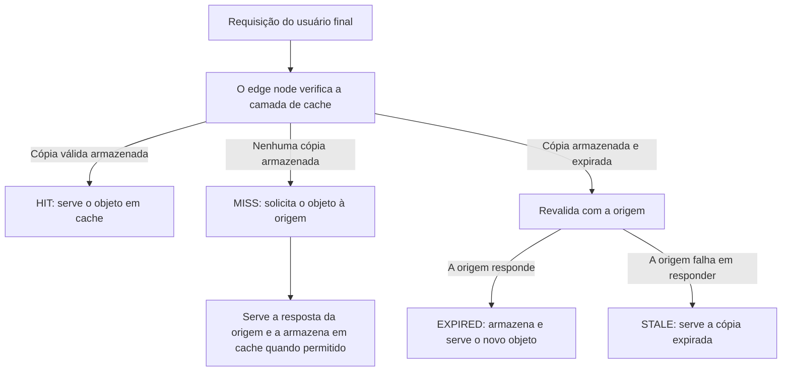

**Cache** armazena conteúdo nos edge nodes da Azion, em uma camada que fica entre seus servidores de origem e o usuário final. Um edge node que tem uma cópia válida responde a partir dessa camada, e a requisição não chega à origem. Um edge node que não tem uma cópia válida busca o objeto na origem.

Cinco mecanismos determinam o que um edge node faz com uma requisição: a busca no cache, o status de cache que ele informa, a proteção da origem, a expiração e o stale cache.

## Busca no cache

Um edge node da Azion resolve toda requisição na camada de cache antes de contatar a origem. O edge node identifica um objeto armazenado por meio da cache key. O resultado da busca determina o caminho que a requisição segue.



O diagrama mostra os resultados de uma busca. Uma cópia válida armazenada é um HIT, e o edge node responde sem contatar a origem. Nenhuma cópia armazenada é um MISS, e o edge node solicita o objeto à origem e armazena a resposta em cache quando permitido.

Uma cópia armazenada que expirou leva o edge node a revalidar com a origem. Quando a origem responde, o edge node armazena o novo objeto e informa EXPIRED. Quando a origem falha e o stale cache está ativado, o edge node serve a cópia expirada e informa STALE.

Para conhecer as regras que formam a cache key consultada pelo edge node, consulte [Cache keys](/pt-br/documentacao/build/cache/reference/cache-keys/).

## Status de cache

Um edge node da Azion informa o resultado de cada busca no cache como um status de cache. Você pode obter o status de um recurso da sua application requisitando a URI do conteúdo com o cabeçalho de debug da Azion `Pragma: azion-debug-cache`. Uma resposta bem-sucedida retorna um cabeçalho `X-Cache` com o status do cache, o IP do edge node e o protocolo utilizado:

```bash
X-Cache: HIT from 200.000.000.00 with HTTP/2.0
```

### Definições de status

| Status | Definição |
| --- | --- |
| **HIT** | Conteúdo válido e atualizado é fornecido diretamente do cache do edge |
| **MISS** | Se o conteúdo da requisição não for encontrado no cache no edge, ele é buscado na origem. Por meio da resposta, o conteúdo pode ser armazenado em cache no edge para futuras requisições |
| **EXPIRED** | O conteúdo em cache expirou o TTL definido no edge. Quando a origem responde, o conteúdo em cache é atualizado para futuras requisições |
| **STALE** | Ao optar por servir [stale cache](#stale-cache), se a origem falhar em responder e o cache edge expirou, uma versão obsoleta do conteúdo é servida |
| **UPDATING** | O conteúdo em cache expirou e o stale cache está sendo servido, mas o conteúdo está sendo atualizado na origem |
| **REVALIDATED** | O conteúdo em cache é verificado contra o da origem usando cabeçalhos condicionais. Se ainda estiver atualizado, o recurso não é retransmitido pela origem |
| **BYPASS** | O edge solicita o conteúdo diretamente da origem em vez de usar uma versão em cache devido ao comportamento [Bypass Cache](/pt-br/documentacao/build/applications/reference/rules-engine/#bypass-cache) |
| **-** | Se nenhum status for recebido, o conteúdo do request está restrito de permanecer em cache. Por exemplo, se o conteúdo é uma requisição `POST` e [Caching for POST](/pt-br/documentacao/build/cache/reference/cache-settings/#cache-de-metodos-http) está desabilitado, o status não é recebido |

---

## Proteção da origem

Quando o conteúdo requisitado não está disponível em cache, o Cache aplica dois mecanismos que limitam a carga que uma requisição não-HIT gera no servidor de origem.

Os edge nodes da Azion mantêm conexões keep-alive com o servidor de origem sempre que possível, para reduzir a sobrecarga associada a handshakes TCP/IP frequentes. As conexões keep-alive atuam durante atualizações de cache e em situações de um cache MISS.

A Azion também implementa o controle de Thundering Herd. Diante de múltiplas requisições simultâneas para o mesmo objeto não armazenado em cache, apenas uma conexão é estabelecida com o servidor de origem. Cada edge node da Azion solicita conteúdo ao servidor de origem apenas uma vez por MISS ou outro status não-HIT.

## Expiração

Dois valores de TTL (*time-to-live*) controlam a expiração do cache: o TTL de cache do navegador e o TTL de cache no edge.

O TTL de cache do navegador controla por quanto tempo o conteúdo permanece armazenado nos navegadores locais. Um TTL de navegador maior reduz a frequência com que os usuários buscam conteúdo no edge ou na origem. Os tempos de carregamento melhoram e o uso de banda diminui.

O TTL de cache no edge controla por quanto tempo seu conteúdo permanece em cache nos edge nodes da Azion. Um TTL de cache maior mantém o conteúdo acessado com frequência mais perto dos usuários e reduz a carga no servidor de origem.

O equilíbrio a encontrar é entre atualidade do conteúdo e carga na origem. Um TTL longo reduz as requisições à origem e serve conteúdo que a origem já pode ter alterado. Um TTL curto mantém o conteúdo atualizado e envia mais requisições à origem. Defina os dois valores a partir da frequência de atualização do seu conteúdo, dos padrões de tráfego e dos seus objetivos de performance.

---

## Stale cache

**Stale Cache** permite que os edge nodes da Azion continuem servindo objetos previamente armazenados em cache mesmo após a expiração deles. O usuário final recebe uma cópia expirada em vez de uma página de erro ou de indisponibilidade. Enquanto isso, o edge node busca conteúdo atualizado na origem.

Um edge node resolve uma requisição sob stale cache em três etapas:

1. Uma configuração de cache tem a opção **Enable Stale Cache** ativada. Toda resposta armazenada no cache no edge pode então ser reutilizada se uma tentativa de revalidação falhar devido a:

   - Erros 5xx retornados pela origem.
   - Timeout de conexão ou indisponibilidade da origem.
   - Cabeçalhos cache-control inválidos ou ausentes.
   - O objeto sendo atualizado (revalidação em andamento).

2. O edge node primeiro procura pela diretiva `stale-while-revalidate=<ttl>`. Com **Honor Origin Cache**, se a origem fornecer a diretiva, esse valor define por quanto tempo o objeto pode ser servido em modo stale. Com **Override Cache Settings**, ou quando a origem omite a diretiva, a Azion atribui uma janela padrão de stale de 300 segundos (5 minutos).

3. Durante a janela de stale, o edge node serve imediatamente a cópia expirada e busca de forma assíncrona uma versão atualizada em segundo plano. Quando o novo objeto é armazenado, as requisições subsequentes recebem o conteúdo atualizado.

O custo é que o usuário final lê conteúdo que a origem já não serve, enquanto durar a janela de stale.

---

## Recursos relacionados

- [Cache](/pt-br/documentacao/build/cache/) - o módulo e seus limites.
- [Cache Settings](/pt-br/documentacao/build/cache/reference/cache-settings/) - os campos que definem TTL, stale cache e adaptive delivery.
- [Cache keys](/pt-br/documentacao/build/cache/reference/cache-keys/) - as regras que formam a cache key consultada pelo edge node.
- [Tiered Cache](/pt-br/documentacao/build/cache/tiered-cache/) - uma camada extra de cache entre o edge e sua origem.
- [Verifique indicadores de cache no navegador](/pt-br/documentacao/build/cache/guides/verificar-tempo-de-cache-da-pagina/) - leia o cabeçalho `X-Cache` no Google Chrome.
- [Cache quickstart](/pt-br/documentacao/build/cache/quickstart/) - coloque uma política de cache em uso.
