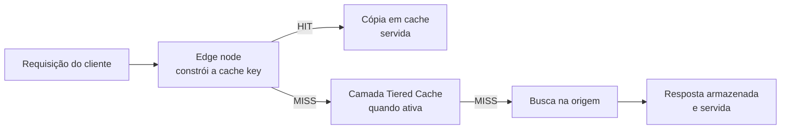

import LinkButton from 'azion-webkit/linkbutton'
import Code from '~/components/Code/Code.astro'

Um cache é uma cópia armazenada de uma resposta, mantida perto das pessoas que a solicitam. A primeira requisição de um objeto viaja até o servidor de origem, e a cópia que retorna é armazenada. As requisições seguintes pelo mesmo objeto são respondidas a partir da cópia. Cada cópia tem um tempo de vida (TTL), o número de segundos em que ela permanece válida. Dentro dessa janela, a origem serve um objeto uma vez, não uma vez por requisição. Para o mecanismo geral, consulte [O que é armazenamento em cache](https://www.azion.com/pt-br/learning/cdn/o-que-e-armazenamento-em-cache/) no Learning Center.

**Cache** armazena essas cópias nos edge nodes da Azion, como um módulo de [Applications](/pt-br/documentacao/build/applications/). Um cache setting contém a política: por quanto tempo um navegador e um edge node mantêm um objeto e o que distingue dois objetos. Uma regra no [Rules Engine](/pt-br/documentacao/build/applications/reference/rules-engine/) aplica o cache setting às requisições que correspondem a ela. O edge node mais próximo do cliente então responde a partir da sua cópia enquanto ela é válida. Sua [origem](/pt-br/documentacao/secure/connectors/reference/origins/) recebe uma busca por objeto em cada edge node, em vez de uma por requisição. Use Cache para servir arquivos estáticos a partir dos edge nodes, manter páginas no ar enquanto sua origem está fora, armazenar respostas de API em cache por cookie ou query string, ou entregar arquivos grandes em fragmentos.

<LinkButton label="Quickstart do Cache" link="/pt-br/documentacao/build/cache/quickstart/" />
<LinkButton severity="secondary" label="Referência de Cache Settings" link="/pt-br/documentacao/build/cache/reference/cache-settings/" />

## Estrutura do cache setting

Um cache setting é o objeto que contém uma política de cache. Uma aplicação contém um ou mais deles, e uma regra escolhe qual deles uma requisição usa. O corpo de requisição a seguir cria um cache setting pela API. Ele sobrescreve os headers de cache da origem com um TTL de 60 segundos no navegador e um TTL de 13.660 segundos no edge node. Stale Cache permanece ativado:

<Code lang="json" code={`{
  "name": "<your-cache-setting-name>",
  "browser_cache": {
    "behavior": "override",
    "max_age": 60
  },
  "modules": {
    "edge_cache": {
      "behavior": "override",
      "max_age": 13660,
      "stale_cache": {
        "enabled": true
      }
    }
  }
}`} />

- `browser_cache` define o que o navegador faz com o objeto. `honor` repassa os headers `Cache-Control` e `Expires` da origem, e `override` os substitui por `max_age`, em segundos.
- `modules.edge_cache` faz a mesma escolha para a cópia no edge node, com os mesmos dois comportamentos e seu próprio `max_age`.
- `stale_cache` decide se uma cópia expirada é servida enquanto a origem falha ou enquanto a cópia é atualizada.

Se você conhece a diretiva `max-age` de `Cache-Control`, você sabe o que `max_age` faz. Cada campo declara esse valor em segundos, uma vez para o navegador e uma vez para o edge node. Todas as chaves, incluindo as variações por query string, cookie, device group e método HTTP, estão em [Cache Settings](/pt-br/documentacao/build/cache/reference/cache-settings/).

---

## Caminho da consulta

Um novo cache setting não se aplica a nenhuma requisição por si só. Uma regra com o comportamento Set Cache Policy o vincula às requisições que correspondem à regra. Cada requisição que um edge node recebe segue então este caminho:

O diagrama mostra uma requisição do cliente até a resposta armazenada. Sem Tiered Cache, o caminho de MISS vai direto do edge node para sua origem.

1. A Azion roteia a requisição para o edge node mais próximo do cliente.
2. O edge node constrói uma cache key a partir do esquema, host, caminho e query string da requisição. Um cache setting que varia o conteúdo por cookie, [device group](/pt-br/documentacao/build/applications/reference/device-groups/) ou método HTTP acrescenta um marcador a essa chave. As chaves diferenciam maiúsculas de minúsculas.
3. Quando o cache contém um objeto válido sob essa chave, o node o serve e registra o status `HIT`. Sua origem não recebe nada.
4. Caso contrário, o node busca o objeto na sua origem e registra `MISS`. Quando Tiered Cache está ativo, a busca passa pela camada do Tiered Cache entre os edge nodes e a origem, que mantém sua própria cópia por mais tempo.
5. Quando muitas requisições chegam ao mesmo tempo para um objeto fora do cache, o node abre uma única conexão com a origem. A origem serve esse objeto uma vez por MISS em cada edge node.
6. A resposta é armazenada sob a chave e servida. Ela permanece válida pelo seu TTL. Uma requisição posterior então a encontra como `EXPIRED` e a atualiza ou, com Stale Cache ativado, recebe a cópia expirada enquanto a atualização é executada.

Os oito valores de status do cache, as conexões keep-alive, a revalidação e a janela stale estão em [Como Cache funciona](/pt-br/documentacao/build/cache/como-funciona/).

---

## Capacidades e limites

O bloco a seguir declara o que um cache setting pode fazer e onde a plataforma o limita. Cada valor corresponde a [Limites do Cache](/pt-br/documentacao/build/cache/limites/), que traz as tabelas completas por plano.

- **TTL.** O TTL no edge node vai de 60 a 31.536.000 segundos, definido em `max_age` ou obtido dos headers da origem. Um valor abaixo de 60 segundos, até 0, requer o módulo [Application Accelerator](/pt-br/documentacao/build/application-accelerator/). Um cache setting com Tiered Cache precisa de um TTL de pelo menos 3 segundos, e a camada do Tiered Cache mantém um objeto por até 2.592.000 segundos.
- **Variações de cache key.** Por padrão, cada URL é um objeto no cache, e apenas respostas `GET` e `HEAD` são armazenadas em cache. Um cache setting também pode variar a chave por campos da query string, nomes de cookie, device group e corpo de uma requisição `POST` ou `OPTIONS` em cache. As variações por query string, cookie e método requerem Application Accelerator, e [Image Processor](/pt-br/documentacao/build/image-processor/) adiciona uma variação por formato de imagem. O formato de cada marcador está em [Cache keys](/pt-br/documentacao/build/cache/reference/cache-keys/).
- **Stale Cache.** Ativado por padrão. Quando a origem retorna um erro `5xx`, excede o tempo limite ou ainda está atualizando o objeto, o edge node serve a cópia expirada. A janela stale é de 300 segundos por padrão. Um cache setting que honra os headers da origem usa, em vez disso, o valor `stale-while-revalidate` da origem.
- **Large File Optimization.** Divide um objeto grande em fragmentos de 1.024 kB por padrão. Cada fragmento é armazenado em cache sob demanda, com sua própria cache key, conforme o cliente o consome. Um único objeto no cache pode ter até 10 GB. Para aumentar qualquer um desses valores no seu plano, entre em contato com a [equipe de suporte técnico](/pt-br/documentacao/services/support/).
- **Tiered Cache.** Um módulo do Cache que adiciona uma segunda camada de cache entre os edge nodes e sua origem, ativado para sua conta pela [equipe de vendas](https://www.azion.com/pt-br/contato/). Seus servidores operam nos Estados Unidos por padrão ou no Brasil sob solicitação. Uma regra Bypass Cache não alcança essa camada: uma aplicação com Tiered Cache continua armazenando em cache nela pelo TTL mínimo. Ativação, regiões e ordem de purge estão em [Tiered Cache](/pt-br/documentacao/build/cache/tiered-cache/).
- **Purge.** [Real-Time Purge](/pt-br/documentacao/build/cache/reference/real-time-purge/) remove um objeto do cache nos edge nodes ou da camada do Tiered Cache antes do fim do seu TTL, por URL, cache key ou wildcard. Um purge por wildcard não alcança a camada do Tiered Cache.
- **Observabilidade.** Cada requisição registra seu status de cache como `Upstream Cache Status` no [Real-Time Events](/pt-br/documentacao/observe/real-time-events/), nas fontes de dados HTTP Requests e Tiered Cache, e como `$upstream_cache_status` no [Data Stream](/pt-br/documentacao/observe/data-stream/). Real-Time Events também expõe seus campos pela [API GraphQL](/pt-br/documentacao/devtools/graphql-api/recursos/campos-gql-real-time-events/). Para uma única resposta, envie o header de requisição `Pragma: azion-debug-cache` e leia os headers de resposta `X-Cache` e `X-Cache-Key`.
- **Cache API do Runtime.** Uma função lê e grava no Cache pela [Cache API](/pt-br/documentacao/runtime/api-reference/cache/). Ela abre um armazenamento de cache nomeado com `caches.open` e então chama `match`, `put` e `delete` nele.
- **WebSocket Proxy.** Incompatível com Cache e Tiered Cache. Uma aplicação que usa [WebSocket Proxy](/pt-br/documentacao/build/applications/reference/websocket/) não pode usar nenhum dos dois módulos, porque a conexão é bidirecional e permanece aberta.
- **Preços.** Cache é cobrado por purges, a cada 1.000 operações, e a franquia de purge de cada plano está na página de limites do Cache. Application Accelerator é cobrado separadamente, por transferência de dados. Para mais informações, consulte [Preços](/pt-br/documentacao/platform/pricing/#cache).

---

## Próximos passos

| Se você quer | Vá para |
| --- | --- |
| Criar um cache setting e aplicá-lo à sua primeira aplicação | [Quickstart do Cache](/pt-br/documentacao/build/cache/quickstart/) |
| Entender a consulta ao cache, os oito status de cache, a expiração e a entrega stale | [Como Cache funciona](/pt-br/documentacao/build/cache/como-funciona/) |
| Consultar cada campo, opção e chave de API de um cache setting | [Cache Settings](/pt-br/documentacao/build/cache/reference/cache-settings/) |
| Ver como uma cache key é construída e quais variações a alteram | [Cache keys](/pt-br/documentacao/build/cache/reference/cache-keys/) |
| Remover um objeto do cache antes do fim do seu TTL | [Real-Time Purge](/pt-br/documentacao/build/cache/reference/real-time-purge/) |
| Adicionar uma segunda camada de cache entre os edge nodes e sua origem | [Tiered Cache](/pt-br/documentacao/build/cache/tiered-cache/) |
| Verificar um limite por plano | [Limites do Cache](/pt-br/documentacao/build/cache/limites/) |
| Configurar uma política no Console ou pela API, fazer purge de conteúdo, verificar headers de cache ou armazenar HLS em cache | [Guias e tutoriais do Cache](/pt-br/documentacao/build/cache/guides/) |
| Gerenciar cache settings a partir de código | [`azion create`](/pt-br/documentacao/devtools/cli/create/), [`azion.config.js`](/pt-br/documentacao/devtools/cli/configs/azion-config-js/), [Applications - Terraform Resources](/pt-br/documentacao/produtos/terraform-provider/resources/applications/) ou [Azion Libraries, Application](/en/documentation/products/azion-lib/application/) |
| Fazer purge a partir de código | [`azion purge`](/pt-br/documentacao/devtools/cli/purge/) ou [Azion Libraries, Purge](/pt-br/documentacao/produtos/azion-lib/purge/) |
| Consultar um termo | [Glossário](/pt-br/documentacao/build/cache/glossario/) |
