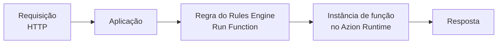

import LinkButton from 'azion-webkit/linkbutton'
import Code from '~/components/Code/Code.astro'

Uma função é código que executa em resposta a um evento, como uma requisição HTTP, em uma infraestrutura que um provedor opera. Você escreve um handler que recebe a requisição e retorna uma resposta. O provedor inicia o handler sob demanda e o encerra assim que a resposta é enviada. Esse modelo se chama [serverless](https://www.azion.com/pt-br/learning/serverless/o-que-e-serverless/): não há servidor para você provisionar, atualizar ou escalar.

**Functions** executa esse handler em JavaScript na rede distribuída da Azion. Você cria uma função uma vez e a instancia em uma aplicação ou em um firewall. Uma regra do [Rules Engine](/pt-br/documentacao/build/applications/reference/rules-engine/) então executa a instância quando uma requisição corresponde aos critérios da regra. Use Functions para construir APIs, renderizar HTML e manipular cabeçalhos de requisição e resposta. Use também Functions para aplicar lógica a partir dos metadados da requisição ou para bloquear requisições antes que sua aplicação as processe.

<LinkButton label="Quickstart" link="/pt-br/documentacao/build/functions/quickstart/" />
<LinkButton severity="secondary" label="Referência de Handlers" link="/pt-br/documentacao/build/functions/reference/handlers/" />

---

## Estrutura da função

Uma função é um único módulo JavaScript que exporta um objeto de handlers. Esta função completa retorna uma página HTML para cada requisição que recebe:

<Code lang="javascript" code={`const html = \`<!DOCTYPE html>
<body>
  <h1>Hello World</h1>
  
This markup was generated by Azion - Functions.

</body>\`;

export default {
  fetch: async (request, env, ctx) => {
    return new Response(html, {
      headers: {
        "content-type": "text/html;charset=UTF-8",
      },
    });
  }
};`} />

- `export default { ... }` é o padrão ES Modules. O objeto exportado nomeia um handler por evento e `fetch` trata as requisições HTTP.
- `fetch(request, env, ctx)` recebe o `Request` de entrada, um objeto `env` com variáveis de ambiente e bindings e um contexto de execução `ctx`. `ctx.waitUntil(promise)` estende o tempo de vida da função para tarefas assíncronas que não devem bloquear a resposta.
- O handler retorna um objeto `Response` da Web. O corpo e os cabeçalhos desse objeto são o que o cliente recebe.

Se você conhece os objetos `Request` e `Response` da Web, você conhece o modelo de código. O objeto exportado, `env` e `ctx` são as adições da plataforma. Functions também aceita o padrão legado Service Worker, `addEventListener('fetch', ...)`, por retrocompatibilidade. Os dois padrões e a migração entre eles estão em [Handlers](/pt-br/documentacao/build/functions/reference/handlers/).

---

## Caminho de invocação

Salvar uma função não a executa. Uma função executa somente depois que uma aplicação a instancia e uma das regras da aplicação seleciona essa instância para uma requisição. A cadeia de uma requisição até sua resposta:

1. Uma requisição HTTP chega a uma aplicação na rede distribuída da Azion.
2. O Rules Engine da aplicação avalia a requisição em relação aos critérios de cada regra, como o URI da requisição. O behavior **Run Function** de uma regra correspondente indica uma instância de função.
3. A instância de função vincula uma função a esta aplicação com seus próprios argumentos JSON. Assim, a mesma função pode servir outras aplicações com outros argumentos.
4. Azion Runtime executa o código da instância em um edge node da Azion e passa a requisição ao handler `fetch`.
5. O `Response` que o handler retorna volta para o cliente.

Azion Runtime é o runtime JavaScript, construído sobre padrões Web, que executa todas as funções. Para as APIs e o comportamento dele, consulte [Azion Runtime](/pt-br/documentacao/runtime/visao-geral/).

---

## Capacidades e limites

Uma função tem estas capacidades e limites padrão:

- **Linguagem**: JavaScript. Você também pode construir uma função a partir de WebAssembly. Consulte [Criar uma função usando WebAssembly](/pt-br/documentacao/build/functions/guides/webassembly-na-plataforma-azion/).
- **Web APIs**: [Web APIs suportadas](/pt-br/documentacao/runtime-apis/javascript/) lista as APIs de rede, de codificação e decodificação e de Web Streams que uma função pode chamar. [Compatibilidade com Node.js](/pt-br/documentacao/produtos/devtools/azion-edge-runtime/compatibilidade/node/) cobre o suporte a Node.js.
- **Metadados da requisição**: a [Metadata API](/pt-br/documentacao/produtos/applications/functions/runtime/api-reference/metadata/) expõe dados de GeoIP, o endereço IP e a porta remotos, o protocolo da requisição e dados de TLS. Uma função pode usá-los para filtrar o acesso conforme a procedência da requisição.
- **Variáveis de ambiente**: uma função lê valores que você configura fora do código dela, como um token de API, para que segredos não fiquem no código-fonte. Consulte [Variáveis de ambiente](/pt-br/documentacao/produtos/functions/environment-variables/).
- **Frameworks**: [Azion Bundler](https://github.com/aziontech/bundler) transforma um projeto de framework web em funções que executam no Azion Runtime, uma por rota, endpoint de API ou componente de servidor. [Compatibilidade com frameworks](/pt-br/documentacao/produtos/devtools/azion-edge-runtime/compatibilidade-frameworks/) lista os frameworks suportados.
- **Dados e IA**: uma função chama [SQL Database](/pt-br/documentacao/store/sql-database/) para armazenamento, que também guarda vetores para geração aumentada por recuperação (RAG). Ela executa modelos por meio de [AI Inference](/pt-br/documentacao/build/ai-inference/) no Azion Runtime.
- **Interfaces**: você cria e gerencia uma função pelo [Azion Console](https://console.azion.com/), pela [Azion API](https://api.azion.com/) ou pela [Azion CLI](/pt-br/documentacao/produtos/azion-cli/visao-geral/) no terminal. O [Terraform Provider](/pt-br/documentacao/produtos/terraform-provider/) gerencia funções na forma de infraestrutura como código.
- **Code Editor**: o [Functions Code Editor](/pt-br/documentacao/produtos/applications/functions/runtime-api/code-editor/) é um editor baseado em navegador no Azion Console, com realce de sintaxe, complementação de código e depuração.
- **Preview Deployment**: [Preview Deployment](/pt-br/documentacao/produtos/applications/functions/runtime-api/preview-deployment/) executa sua função com uma requisição simulada antes de ela ir para produção.
- **Debugging**: [Debugging](/pt-br/documentacao/devtools/debugging/) coleta a saída de `console.log` de uma função em execução por meio de Data Stream ou da GraphQL API. As configurações estão em [Depurar com Data Stream](/pt-br/documentacao/observe/data-stream/guides/debugging-functions-data-stream/) e [Depurar com GraphQL](/pt-br/documentacao/build/functions/guides/debugging-functions-graphql/).
- **Assistente de IA**: o [assistente de IA](/pt-br/documentacao/produtos/applications/functions/runtime-api/ai-integration/) no Code Editor explica, gera e refatora código a partir de um prompt. Ele usa uma chave de API que você fornece.
- **Limites padrão**: uma função recebe 512 MB de memória por isolate, seu contexto de execução, e 50 chamadas `fetch()` de saída (sub-requisições) por invocação. Ela tem 2 s de tempo de CPU e 5 min de tempo de relógio por invocação. Uma função que excede seu tempo de CPU é encerrada. O código-fonte é limitado a 6 MB pelo Azion Console e a 20 MB pela API. Os argumentos JSON são limitados a 100 KB por instância. Uma função tem no máximo 2 s de cold start, o tempo para inicializar antes da primeira requisição. O tamanho do corpo da requisição e da resposta depende do seu plano. Para a tabela completa, consulte [Limites de Functions](/pt-br/documentacao/build/functions/limites/).

---

## Functions no Firewall

[Firewall](/pt-br/documentacao/secure/firewall/) executa funções na fase de requisição, por meio de instâncias de função e regras no Rules Engine do próprio firewall. Azion Runtime processa a função e retorna um resultado. O Rules Engine retoma a partir da regra que a acionou com base nesse resultado. No handler `firewall`, `ctx.deny()` bloqueia a requisição. Um handler que retorna sem chamá-lo deixa a requisição continuar até `fetch`. Para as APIs de cabeçalhos e metadados que uma função de firewall pode usar, consulte [Functions para Firewall](/pt-br/documentacao/secure/firewall/reference/functions/).

---

## Próximos passos

| Se você quer | Vá para |
| --- | --- |
| Executar sua primeira função | [Quickstart de Functions](/pt-br/documentacao/build/functions/quickstart/) |
| Começar a partir de código de exemplo | [Exemplos em JavaScript](/pt-br/documentacao/devtools/javascript-exemplos/) |
| Entender o modelo de eventos e por que as instâncias existem | [Como Functions funciona](/pt-br/documentacao/build/functions/como-funciona/) |
| Consultar assinaturas de handlers, parâmetros e o padrão legado | [Handlers](/pt-br/documentacao/build/functions/reference/handlers/) |
| Consultar campos de instância, argumentos JSON e o behavior Run Function | [Functions Instances](/pt-br/documentacao/build/functions/reference/functions-instances/) |
| Seguir um guia para uma tarefa, como um webhook ou um paywall | [Guias e tutoriais de Functions](/pt-br/documentacao/build/functions/guides/) |
| Verificar um limite antes de projetar | [Limites de Functions](/pt-br/documentacao/build/functions/limites/) |
| Verificar o custo de tempo de computação e invocações | [Preços](/pt-br/documentacao/platform/pricing/#functions) |
| Consultar um termo | [Glossário](/pt-br/documentacao/build/functions/glossario/) |
