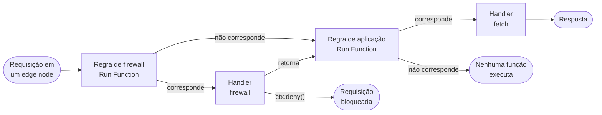
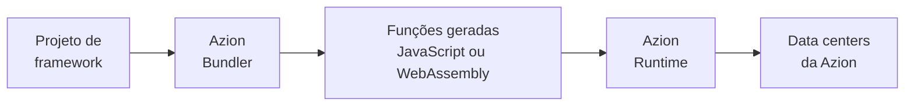

import Code from '~/components/Code/Code.astro'

Uma função é um handler executado quando uma requisição chega. O handler recebe a requisição e retorna uma resposta, ou decide se a requisição pode continuar. [Azion Runtime](/pt-br/documentacao/runtime/visao-geral/) inicia o handler sob demanda no edge node que recebeu a requisição. Ele encerra o handler quando a resposta é enviada, por isso não há servidor para provisionar ou escalar.

Na Azion, três objetos concretizam esse comportamento. [Functions](/pt-br/documentacao/build/functions/) armazena o código como uma função. Uma instância de função vincula essa função a uma [aplicação](/pt-br/documentacao/build/applications/) ou a um [firewall](/pt-br/documentacao/secure/firewall/) e carrega os argumentos que o código lê. Uma regra no [Rules Engine](/pt-br/documentacao/build/applications/reference/rules-engine/) seleciona as requisições que chegam à instância. As seções a seguir cobrem o caminho da requisição, as instâncias de função e, em seguida, os handlers e o modelo de eventos. A seção final cobre os builds de framework via Azion Bundler.

## Caminho da requisição

Uma requisição chega a uma função somente por meio de uma regra que nomeia sua instância. O diagrama acompanha uma requisição do edge node que a recebeu, pelo firewall e pela aplicação, até a resposta.

A requisição passa primeiro pelo Rules Engine do firewall. Quando uma regra de firewall com o behavior **Run Function** corresponde à requisição, [Azion Runtime](/pt-br/documentacao/runtime/visao-geral/) executa o handler `firewall` da instância vinculada na fase de requisição. Uma chamada a `ctx.deny()` bloqueia a requisição imediatamente, e o handler `fetch` nunca é executado para ela. Quando o handler retorna sem essa chamada, Rules Engine do firewall retoma de onde o behavior foi acionado, e a requisição continua para a aplicação.

Rules Engine da aplicação então aplica suas próprias regras, e uma regra **Run Function** cujos critérios correspondem executa o handler `fetch` da instância selecionada. Esse handler retorna uma `Response` ao cliente. Uma requisição que não corresponde a nenhuma regra de firewall segue direto para as regras da aplicação. Uma que não corresponde a nenhuma regra de aplicação não executa nenhuma função.

Uma regra decide quais requisições um handler vê. Uma regra de aplicação pode selecionar requisições por caminho, como `${uri}` igual a `/hello-world`. No firewall, uma regra pode selecioná-las por uma network list de países. O handler `firewall` também pode ler os metadados da requisição, como o país ou o endereço IP do cliente, antes de decidir. Para os campos de metadados, consulte [Metadata API](/pt-br/documentacao/produtos/applications/functions/runtime/api-reference/metadata/).

Nada nesse caminho é automático. Uma função salva não executa nada sozinha, e uma instância não executa nada até que uma regra a nomeie em um behavior **Run Function**. A aplicação ou o firewall também precisa ter o módulo **Functions** ativado antes de poder conter uma instância. Uma função que nunca é executada geralmente está sem um elo dessa cadeia: o módulo, a instância ou uma regra cujos critérios a requisição atende.

O preço desse design é a configuração: três objetos, cada um criado separadamente, antes que uma única requisição chegue ao seu código. Em troca, a mesma função pode ficar atrás de várias regras. Uma regra também filtra o tráfego antes que o handler seja executado, por isso o próprio código não inspeciona cada requisição. Uma requisição que o firewall nega nunca chega às regras da aplicação, por isso a aplicação não faz nenhum trabalho para ela.

---

## Instâncias de função

O mesmo código muitas vezes precisa ser executado em vários lugares com configurações diferentes. Uma instância de função vincula uma função salva a uma aplicação ou a um firewall e carrega os argumentos que diferenciam esse vínculo do próximo. O código não é editável na instanciação, por isso uma instância muda o que a função recebe, nunca o que ela faz.

Os argumentos são um objeto JSON. A definição da função pode ter argumentos padrão. Os argumentos da instância os sobrescrevem chave por chave, por isso o handler recebe o objeto mesclado. O behavior **Run Function** de uma regra aponta para uma instância, não para uma função. Essa indireção é o que permite que uma função fique atrás de várias regras, cada uma com seus próprios argumentos. Você muda o comportamento pelos argumentos e deixa o código como está, e uma função atende várias aplicações.

O preço é a indireção. Uma regra nomeia uma instância e a instância nomeia uma função, por isso quem lê a regra percorre dois elos até chegar ao código. Você define em cada instância um argumento que varia por aplicação. Uma mudança na lógica é uma mudança na função, nunca em uma instância.

Um objeto args acima de 100 KB falha na instanciação, por isso esse teto limita quanta configuração uma instância carrega. Para o conjunto completo de limites, consulte [Limites de Functions](/pt-br/documentacao/build/functions/limites/). Para os campos da instância e como padrões e sobrescritas se mesclam, consulte [Functions Instances](/pt-br/documentacao/build/functions/reference/functions-instances/).

---

## Handlers e o modelo de eventos

[Azion Runtime](/pt-br/documentacao/runtime/visao-geral/) chama seu código por um ponto de entrada fixo. Uma função, portanto, é entregue como um módulo ES cujo export padrão é um objeto com handlers nomeados. O handler `fetch` responde a uma requisição, e o handler `firewall` decide se uma requisição pode continuar. O runtime chama o handler que corresponde ao evento e passa a requisição a ele.

Um módulo com os dois handlers tem esta forma:

<Code lang="javascript" code={`export default {
  fetch: async (request, env, ctx) => {
    return new Response('Access granted');
  },

  firewall: async (request, env, ctx) => {
    const userAgent = request.headers.get('User-Agent');

    // Bloqueia requisições de bots
    if (userAgent && userAgent.includes('bot')) {
      ctx.deny();
      return;
    }

    // Permite que a requisição continue para o handler fetch
    return;
  }
};`} />

Cada handler recebe os mesmos três parâmetros. `request` é o objeto `Request` da Web para a requisição HTTP recebida, e `env` contém variáveis de ambiente e bindings. `ctx` é o contexto de execução, e ele carrega as duas chamadas que moldam o modelo de eventos.

Uma função executa dentro de um contexto de execução, um isolate, que contém o heap, a stack e cada alocação de runtime que o código faz. Antes de uma função atender sua primeira requisição, ela inicializa, e esse tempo de inicialização é o seu cold start. A memória que um isolate contém e o tempo que um cold start leva têm, cada um, um teto. Para os valores, consulte [Limites de Functions](/pt-br/documentacao/build/functions/limites/).

Um handler `fetch` retorna uma `Response`, e o tempo de vida da função termina com ela. Trabalho que precisa durar mais que a resposta, como a escrita de um log, vai para `ctx.waitUntil(promise)`. Essa chamada estende o tempo de vida da função para que a tarefa seja concluída. Um handler `firewall` não retorna nada: ele chama `ctx.deny()` para bloquear a requisição imediatamente, ou retorna para deixar a requisição continuar até o handler `fetch`.

O contrato do ponto de entrada é fixo, e essa é a contrapartida. Um módulo que exporta uma função avulsa, exporta handlers nomeados ou não exporta nada não corresponde a nenhum padrão suportado. Esse código falha com o erro `Unsupported handler pattern detected`. A forma Service Worker, que registra handlers com `addEventListener`, continua suportada por retrocompatibilidade. A Azion recomenda a forma ES Modules para código novo e a migração para código existente. Para as tabelas de parâmetros, o mapeamento de migração e as formas não suportadas, consulte [Handlers](/pt-br/documentacao/build/functions/reference/handlers/).

---

## Builds de framework via Azion Bundler

Um projeto de framework web não é um módulo de handler. Sua lógica do lado do servidor, rotas de API e middleware seguem as convenções do próprio framework, não o contrato do handler. [Azion Bundler](https://github.com/aziontech/bundler), um adaptador de frameworks de código aberto, transforma esse código em funções que são executadas no [Azion Runtime](/pt-br/documentacao/runtime/visao-geral/).

O diagrama mostra o pipeline do projeto até o data center. O bundler trabalha em quatro etapas:

1. **Detecção do framework.** Quando você inicializa um projeto pela [Azion CLI](/pt-br/documentacao/produtos/azion-cli/visao-geral/), o bundler identifica o framework e aplica o adaptador correspondente.
2. **Transformação do código.** O bundler converte a lógica do lado do servidor, as rotas de API e o middleware do framework em funções compatíveis com Azion Runtime.
3. **Geração das funções.** Cada rota, endpoint de API ou componente de servidor se torna uma função executada de forma independente.
4. **Implantação.** A Azion distribui as funções pela sua rede, onde elas são executadas como qualquer outra função.

O artefato implantado é um conjunto de funções geradas, não os arquivos que você escreveu. Você depura essas funções, não os arquivos-fonte, com [Preview Deployment](/pt-br/documentacao/produtos/applications/functions/runtime-api/preview-deployment/), [Data Stream](/pt-br/documentacao/observe/data-stream/guides/debugging-functions-data-stream/) ou a [API GraphQL](/pt-br/documentacao/build/functions/guides/debugging-functions-graphql/). O código do framework acessa variáveis de ambiente pela [API de variáveis de ambiente](/pt-br/documentacao/produtos/functions/environment-variables/).

Cada função gerada é cobrada como função: tempo de computação e invocações geram cobranças, por isso um framework com muitas rotas implanta muitas funções faturáveis. Para as tarifas, consulte [Preços](/pt-br/documentacao/platform/pricing/#functions). Para os frameworks suportados, consulte [Compatibilidade de frameworks](/pt-br/documentacao/produtos/devtools/azion-edge-runtime/compatibilidade-frameworks/).

---

## Recursos relacionados

- [Handlers](/pt-br/documentacao/build/functions/reference/handlers/) - As tabelas de parâmetros de `fetch` e `firewall`, os dois padrões de handler e o mapeamento de migração.
- [Functions Instances](/pt-br/documentacao/build/functions/reference/functions-instances/) - Os campos da instância, os args em JSON e como padrões e sobrescritas se mesclam.
- [Limites de Functions](/pt-br/documentacao/build/functions/limites/) - Cada limite que se aplica a uma função, com sua unidade.
- [Quickstart de Functions](/pt-br/documentacao/build/functions/quickstart/) - A cadeia de função, instância e regra construída uma vez, de ponta a ponta.
- [Rules Engine](/pt-br/documentacao/build/applications/reference/rules-engine/) - Os critérios e behaviors que uma regra usa para selecionar requisições, incluindo **Run Function**.
- [Functions para Firewall](/pt-br/documentacao/secure/firewall/reference/functions/) - O comportamento na fase de requisição de uma função vinculada a um firewall.
- [Azion Runtime](/pt-br/documentacao/runtime/visao-geral/) - O runtime que executa funções e as Web APIs que ele expõe.
- [Guias e tutoriais de Functions](/pt-br/documentacao/build/functions/guides/) - Os guias que aplicam este modelo, de uma primeira instância até a depuração.
