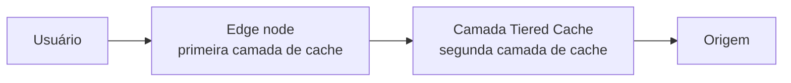

**Tiered Cache** é um módulo de [Cache](/pt-br/documentacao/build/cache/) que adiciona uma segunda camada de cache entre os edge nodes da Azion e a sua origem. Um edge node sem o objeto solicitado consulta a camada Tiered Cache antes da origem, por isso os objetos permanecem em cache por mais tempo. O módulo exige ativação para a sua conta pelo time de vendas e, depois, o switch do módulo ligado em cada aplicação que o usa. Para o mecanismo genérico, consulte [tiered caching no Learning Center](https://www.azion.com/pt-br/learning/cdn/o-que-e-tiered-caching/).

Com o módulo ativo, uma requisição passa por duas camadas de cache antes de chegar à origem:

O edge node responde a partir do próprio cache quando tem o objeto. Caso contrário, ele consulta a camada Tiered Cache. A camada consulta a origem apenas quando a própria cópia está ausente ou expirada. O caminho completo de consulta, com os valores de status do cache, está em [Como Cache funciona](/pt-br/documentacao/build/cache/como-funciona/).

---

## Ativação

Tiered Cache está disponível apenas depois que o time de vendas ativa o serviço para a sua conta. Com o serviço ativo, você liga ou desliga o módulo por aplicação na aba **Main Settings**, desde que nenhuma dependência existente bloqueie a desativação. Um cache setting então mantém objetos na camada apenas quando o TTL dele atende ao mínimo.

| Escopo | Requisito |
| --- | --- |
| Conta | Ativação do serviço pelo [time de vendas](https://www.azion.com/pt-br/contato/) |
| Aplicação | O módulo **Tiered Cache** ligado na aba [Main Settings](/pt-br/documentacao/build/applications/reference/main-settings/) |
| Cache setting | Um TTL de pelo menos 3 segundos |

Ligar o módulo pode gerar custos relacionados ao uso. Para as tarifas, consulte [Preços](/pt-br/documentacao/platform/pricing/).

[WebSocket Proxy](/pt-br/documentacao/build/applications/reference/websocket/) é incompatível com os módulos Cache e Tiered Cache, por isso uma aplicação que usa WebSocket Proxy não pode usar a camada.

## TTL

Um cache setting mantém objetos na camada Tiered Cache apenas quando o TTL dele é de 3 segundos ou mais. Abaixo desse valor, o cache setting não pode usar o módulo. A camada retém um objeto por no máximo 2.592.000 segundos. O TTL do edge cache de um cache setting tem os próprios limites, com um padrão de 60 segundos.

| Escopo | Valor |
| --- | --- |
| TTL mínimo de um cache setting com Tiered Cache | 3 segundos |
| TTL máximo na camada Tiered Cache | 2.592.000 segundos |
| TTL padrão de um cache setting | 60 segundos |

Para os limites do TTL do edge cache, consulte [Limites do Cache](/pt-br/documentacao/build/cache/limites/). Para definir o TTL de um cache setting, consulte [Cache Settings](/pt-br/documentacao/build/cache/reference/cache-settings/).

## Regiões

Os servidores da camada Tiered Cache são hospedados nos Estados Unidos por padrão. Azion também os hospeda no Brasil, para que você mantenha a camada mais perto dos seus usuários. Uma troca de região para uma aplicação passa pelo time de vendas.

| Região | Identificador | Padrão |
| --- | --- | --- |
| Estados Unidos | `na-united-states` | Sim |
| Brasil | `sa-brazil` | Não |

Para trocar uma aplicação de região, entre em contato com o [time de vendas](https://www.azion.com/pt-br/contato/).

---

## Large File Optimization

[Large File Optimization](/pt-br/documentacao/build/cache/reference/cache-settings/) fragmenta um arquivo grande e armazena cada fragmento em cache sob demanda, conforme o usuário o consome. Com o módulo Tiered Cache ativo, o recurso se aplica à camada Tiered Cache e também à camada do edge cache. Na Azion CLI, `--slice-configuration-enabled` liga o recurso e `--slice-l2-caching-enabled` o estende à camada Tiered Cache.

## Real-Time Purge

[Real-Time Purge](/pt-br/documentacao/build/cache/reference/real-time-purge/) remove um objeto da camada Tiered Cache antes do fim do TTL dele. Faça purge primeiro da camada Tiered Cache e depois da camada do edge cache, **Cache**. Na ordem inversa, um edge node pode buscar de volta a cópia desatualizada a partir da camada. A camada Tiered Cache está disponível como camada de purge apenas enquanto o módulo está ativo.

| Tipo de purge | Alcança a camada Tiered Cache |
| --- | --- |
| Purge por URL | Sim |
| Purge por cache key | Sim |
| Purge por wildcard | Não |

Os fragmentos criados por Large File Optimization saem da camada por meio de um purge por cache key que lista cada fragmento. Um purge por wildcard não os alcança. Para os formatos de argumento e os limites de purge, consulte [Real-Time Purge](/pt-br/documentacao/build/cache/reference/real-time-purge/). Para executar um purge, consulte [Faça purge de conteúdo em cache](/pt-br/documentacao/build/cache/guides/purgar-conteudo/).

## Bypass Cache

O behavior [Bypass Cache](/pt-br/documentacao/build/applications/reference/rules-engine/#bypass-cache) de Rules Engine envia uma requisição para a origem em vez de para o edge cache. O behavior não alcança a camada Tiered Cache. Uma aplicação com o módulo ativo continua a armazenar em cache nessa camada pelo TTL mínimo, mesmo quando uma regra Bypass Cache corresponde à requisição.

---

## Interfaces

O switch do Console controla o módulo para a aplicação inteira. A chave da requisição da API, as flags da CLI e as chaves de configuração se aplicam a um cache setting.

| Interface | Configuração |
| --- | --- |
| Azion Console | O módulo **Tiered Cache** na aba **Main Settings** da aplicação. |
| API | `modules.tiered_cache.topology` no corpo da requisição do cache setting: `"near-edge"` ou `"near-origin"` (se houver suporte). |
| Azion CLI | `--l2-caching-enabled` em `azion create cache-setting` liga o módulo para o cache setting; `--slice-l2-caching-enabled` liga Large File Optimization para a camada Tiered Cache. |
| `azion.config.js` | `tieredCache: { enabled, topology }` em um objeto `AzionCache`; `topology` aceita `'nearest-region'`, `'br-east-1'` ou `'us-east-1'`. |

Para as flags, consulte [azion create](/pt-br/documentacao/devtools/cli/create/). Para o arquivo de configuração, consulte [azion.config.js](/pt-br/documentacao/devtools/cli/configs/azion-config-js/).

## Dados de uso

O dataset `workloadConsumptionMetrics` da GraphQL Consumption API informa as requisições e os dados transferidos de Tiered Cache durante até 24 meses.

| Campo | Valor |
| --- | --- |
| Dataset | `workloadConsumptionMetrics` |
| `productId` | `1564082375` |
| `metricName` | `requests`, `data_transferred_total` |
| Retenção | Até 24 meses |

Para a query, consulte [Consultar dados de uso de Tiered Cache com GraphQL](/pt-br/documentacao/produtos/guias/consultar-dados-de-uso-tiered-cache-com-graphql/). Real-Time Events registra cada requisição a uma aplicação que usa Tiered Cache no dataset Tiered Cache. Para os campos, consulte [Real-Time Events](/pt-br/documentacao/observe/real-time-events/).

---

## Limites

:::tip[Dica]
**Aumentar limites**   
Você pode solicitar o aumento dos limites com base no seu plano. Entre em contato com o [time de suporte técnico](/pt-br/documentacao/services/support/) para solicitar.
:::

Estes são os **limites padrão**:

| Escopo | Limite |
| --- | --- |
| TTL mínimo em Tiered Cache | 3 segundos |
| TTL máximo em Tiered Cache | 2.592.000 segundos |

Para todos os limites de Cache por plano, consulte [Limites do Cache](/pt-br/documentacao/build/cache/limites/).

## Recursos relacionados

- [Como Cache funciona](/pt-br/documentacao/build/cache/como-funciona/) - o caminho de consulta pelas duas camadas de cache, os valores de status do cache e a expiração.
- [Cache Settings](/pt-br/documentacao/build/cache/reference/cache-settings/) - todos os campos de um cache setting, incluindo os modos de TTL e Large File Optimization.
- [Real-Time Purge](/pt-br/documentacao/build/cache/reference/real-time-purge/) - os tipos de purge, os formatos de argumento deles e os limites de purge.
- [Limites do Cache](/pt-br/documentacao/build/cache/limites/) - todos os limites de Cache, por plano.
- [Configure uma política de cache](/pt-br/documentacao/build/cache/guides/cache-settings/) - crie o cache setting ao qual o módulo se aplica.
- [Faça purge de conteúdo em cache](/pt-br/documentacao/build/cache/guides/purgar-conteudo/) - os passos para executar um purge.
- [Main Settings](/pt-br/documentacao/build/applications/reference/main-settings/) - os switches de módulo de uma aplicação.
